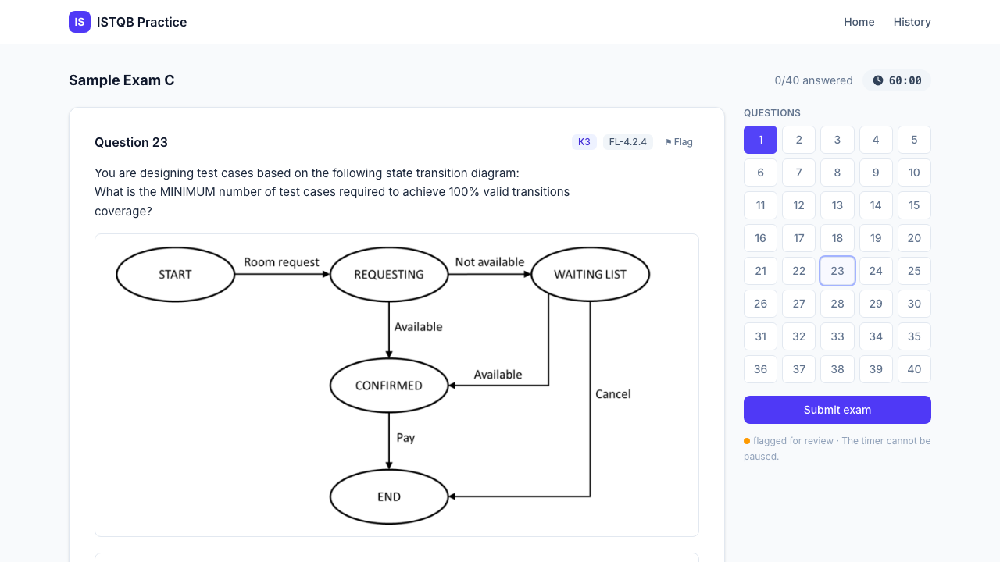
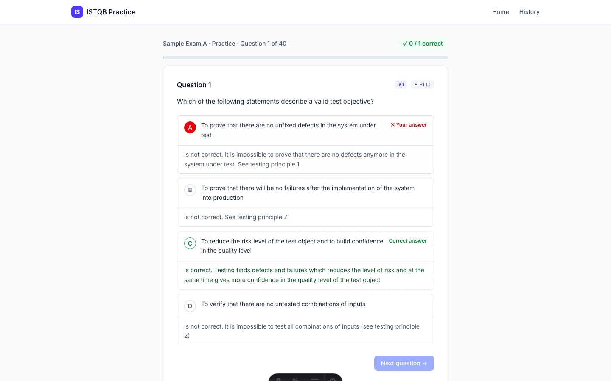

# ISTQB Foundation Level (CTFL) v4.0 Practice Platform

**Live app: <https://joanesquivel.github.io/istqb-ctfl/>**

A static web app to prepare for the **ISTQB® Certified Tester Foundation Level (CTFL) v4.0** exam — the entry-level ISTQB certification (this project does not cover the Advanced, Expert, or specialist tracks). It uses the four official sample exams (A–D) plus a bonus set of 26 extra questions from Exam A's appendix.

Looking to take the real exam or read the official syllabus? See the [official CTFL v4.0 page at istqb.org](https://istqb.org/certifications/certified-tester-foundation-level-ctfl-v4-0/).

| Exam mode | Practice mode |
|---|---|
|  |  |

## Features

- **Exam mode** — real exam conditions: 60-minute countdown (optional +25% → 75 min, the ISTQB extension for non-native English speakers), free navigation, flag-for-review, no feedback until you submit. Auto-submits when time runs out. Refreshing the page never loses progress: the attempt resumes with the true wall-clock time remaining.
- **Practice mode** — one question at a time, no timer. After every answer (right or wrong) you see the explanation for **every** option — why the correct one is correct and why each distractor is not — plus the shared rationale when the question has one.
- **Results & review** — pass/fail banner against the official pass mark (26/40 = 65%), score ring, breakdown by syllabus chapter and K-level, a clickable green/red per-question map, and a filterable review list (All / Incorrect / Flagged).
- **Attempt history** — every finished attempt is kept in `localStorage` (no backend, no accounts) and can be fully re-reviewed later.
- Handles the exam quirks faithfully: "Select TWO" questions (5 options, all-or-nothing scoring), figure questions (state diagrams rendered as cropped images), unanswered = incorrect.

## Tech stack

[Astro 5](https://astro.build) (static output) + React 19 islands + Tailwind CSS v4. No server: exam data is imported at build time and all state lives in the browser.

## Getting started

```bash
npm install
npm run dev        # http://localhost:4321/istqb-ctfl/
```

| Command | Purpose |
|---|---|
| `npm run dev` | Dev server |
| `npm run build` | Static build to `dist/` |
| `npm run preview` | Serve the built site |
| `npm run check` | Type-check (`astro check`) |
| `npm run check:data` | Validate the exam JSONs (counts, answer-key invariants, image files) |

Dev-only trick: `/exam/B/?dur=30` overrides the exam duration to 30 seconds to test the timeout flow.

## Project structure

```
Assets/                  Source ISTQB PDFs (ground truth)
converted_assets/        exam-{A..D}.json + .md + images/ — generated, consumed by the app
.claude/skills/exam-pdf-to-markdown/   Data pipeline (PDF → JSON/MD, validation, figure crops)
src/
  lib/                   Exam catalog, grading, storage, config (60/75 min, 65% pass)
  components/quiz/       State machine (reducer), timer, quiz screens
  components/results/    Results/review screens
  pages/                 / · /exam/[id] · /history · /review
docs/superpowers/specs/  Validated design spec
```

## Data pipeline

The JSONs in `converted_assets/` are the app's source of truth and are **generated, never hand-edited**. The `exam-pdf-to-markdown` skill converts each PDF pair (Questions + Answers) with a deterministic parser, validates every question (gapless numbering, answer letters, `selectCount` vs correct options, LO/K-level formats, 65% pass mark), and renders diagram-only crops for figure questions. To add a new sample exam, drop its PDF pair in `Assets/` and run the pipeline.

## Deployment

Pushing to `main` triggers `.github/workflows/deploy.yml`: data validation → Astro build → GitHub Pages. The site is served from `/istqb-ctfl/` (configured via `site`/`base` in `astro.config.mjs`).

## Attribution

Exam content © [ISTQB®](https://www.istqb.org) — the sample exams are publicly available documents, included here for personal study purposes. This project is not affiliated with or endorsed by ISTQB.
