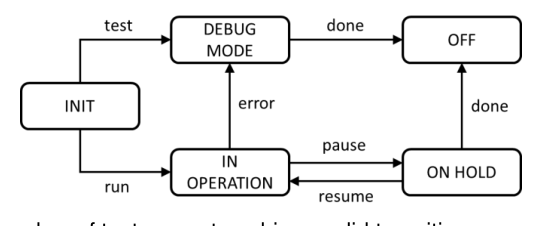

# ISTQB CTFL v4.0 Sample Exam A v1.7

## Question 1

- **Points:** 1 | **LO:** FL-1.1.1 | **K-Level:** K1 | **Select:** 1

Which of the following statements describe a valid test objective?

**Options:**

- **a)** To prove that there are no unfixed defects in the system under test
- **b)** To prove that there will be no failures after the implementation of the system into production
- **c)** To reduce the risk level of the test object and to build confidence in the quality level
- **d)** To verify that there are no untested combinations of inputs

**Correct answer:** c

**Explanations:**

- **a)** Is not correct. It is impossible to prove that there are no defects anymore in the system under test. See testing principle 1
- **b)** Is not correct. See testing principle 7
- **c)** Is correct. Testing finds defects and failures which reduces the level of risk and at the same time gives more confidence in the quality level of the test object
- **d)** Is not correct. It is impossible to test all combinations of inputs (see testing principle 2)

---

## Question 2

- **Points:** 1 | **LO:** FL-1.2.1 | **K-Level:** K2 | **Select:** 1

Which of the following options shows an example of test activities that contribute to success?

**Options:**

- **a)** Having testers involved during various software development lifecycle (SDLC) activities will help to detect defects in work products
- **b)** Testers try not to disturb the developers while coding, so that the developers write better code
- **c)** Testers collaborating with end users help to improve the quality of defect reports during component integration and system testing
- **d)** Certified testers will design much better test cases than non-certified testers

**Correct answer:** a

**Explanations:**

- **a)** Is correct. It is important that testers are involved from the beginning of the software development lifecycle (SDLC). It will increase understanding of design decisions and will detect defects early.
- **b)** Is not correct. Both developers and testers will have more understanding of each other's work products and how to test the code
- **c)** Is not correct. End users will not help the testers in increasing the quality of defect reports; also, users usually do not participate in low-level testing levels like integration testing
- **d)** Is not correct. Being certified does not automatically mean that the tester will be better in test design

---

## Question 3

- **Points:** 1 | **LO:** FL-1.3.1 | **K-Level:** K2 | **Select:** 1

You have been assigned as a tester to a team producing a new system incrementally. You have noticed that no changes have been made to the existing regression test cases for several iterations and no new regression defects were identified. Your manager is happy, but you are not. Which testing principle explains your skepticism?

**Options:**

- **a)** Tests wear out
- **b)** Absence-of-defects fallacy
- **c)** Defects cluster together
- **d)** Exhaustive testing is impossible

**Correct answer:** a

**Explanations:**

- **a)** Is correct. This principle means that if the same tests are repeated over and over again, eventually these tests no longer find any new defects. This is probably why the tests all passed in this release as well
- **b)** Is not correct. This principle says about the mistaken belief that just finding and fixing a large number of defects will ensure the success of a system
- **c)** Is not correct. This principle says that a small number of components usually contain most of the defects
- **d)** Is not correct. This principle states that testing all combinations of inputs and preconditions is not feasible

---

## Question 4

- **Points:** 1 | **LO:** FL-1.4.1 | **K-Level:** K2 | **Select:** 1

You work in a team that develops a mobile application for food ordering. In the current iteration the team decided to implement the payment functionality.
Which of the following activities is a part of test analysis?

**Options:**

- **a)** Estimating that testing the integration with the payment service will take 8 person-days
- **b)** Deciding that the team should test if it is possible to properly share payment between many users
- **c)** Using boundary value analysis (BVA) to derive the test data for the test cases that check the correct payment processing for the minimum allowed amount to be paid
- **d)** Analyzing the discrepancy between the actual result and expected result after executing a test case that checks the process of payment with a credit card, and reporting a defect

**Correct answer:** b

**Explanations:**

- **a)** Is not correct. Estimating the test effort is part of test planning
- **b)** Is correct. This is an example of defining test conditions which is a part of test analysis
- **c)** Is not correct. Using test techniques to derive coverage items is a part of test design
- **d)** Is not correct. Reporting defects found during dynamic testing is a part of test execution

---

## Question 5

- **Points:** 1 | **LO:** FL-1.4.2 | **K-Level:** K2 | **Select:** 1

Which of the following factors have a SIGNIFICANT influence on the test approach?
i. The SDLC
ii. The number of defects detected in previous projects
iii. The identified product risks
iv. New regulatory requirements forcing formal white-box testing
v. The test environment setup

**Options:**

- **a)** i, ii have significant influence
- **b)** i, iii, iv have significant influence
- **c)** ii, iv, v have significant influence
- **d)** iii, v have significant influence

**Correct answer:** b

**Rationale:**

i. Is true. The SDLC has an influence on the test approach
ii. Is false. The number of defects detected in previous projects may
have some influence, but this is not as significant as i, iii and iv
iii. Is true. The identified product risks are one of the most important
factors influencing the test approach
iv. Is true. Regulatory requirements are important factors influencing the
test approach
v. Is false. The test environment has no significant influence on the test
approach
Thus:

**Explanations:**

- **a)** Is not correct
- **b)** Is correct
- **c)** Is not correct
- **d)** Is not correct

---

## Question 6

- **Points:** 1 | **LO:** FL-1.4.5 | **K-Level:** K2 | **Select:** 2

Which TWO of the following tasks belong MAINLY to a testing role?

**Options:**

- **a)** Configure test environments
- **b)** Maintain the product backlog
- **c)** Design solutions to new requirements
- **d)** Create the test plan
- **e)** Analyze the test basis

**Correct answer:** a, e

**Explanations:**

- **a)** Is correct. This is done by the testers
- **b)** Is not correct. The product backlog is built and maintained by the product owner
- **c)** Is not correct. This is done by the development team
- **d)** Is not correct. This is a managerial role
- **e)** Is correct. This is done by the testers since its technical task done as part of a test analysis.

---

## Question 7

- **Points:** 1 | **LO:** FL-1.5.1 | **K-Level:** K2 | **Select:** 1

Which of the following skills (i-v) are the MOST important skills of a tester?
i. Having domain knowledge
ii. Creating a product vision
iii. Being a good team player
iv. Planning and organizing the work of the team
v. Critical thinking

**Options:**

- **a)** ii and iv are important
- **b)** i, iii and v are important
- **c)** i, ii and v are important
- **d)** iii and iv are important

**Correct answer:** b

**Rationale:**

i. Is true. Having domain knowledge is an important tester skill
ii. Is false. This is a task of the business analyst together with the
business representative
iii. Is true. Being a good team player is an important skill
iv. Is false. Planning and organizing the work of the team is a task of the
test manager or, mostly in an Agile software development project,
the whole team and not just the tester
v. Is true. Critical thinking is one of the most important skills of testers
Thus:

**Explanations:**

- **a)** Is not correct
- **b)** Is correct
- **c)** Is not correct
- **d)** Is not correct

---

## Question 8

- **Points:** 1 | **LO:** FL-1.5.2 | **K-Level:** K1 | **Select:** 1

How is the whole team approach present in the interactions between testers and business representatives?

**Options:**

- **a)** Business representatives decide on test automation approaches
- **b)** Testers help business representatives to define a test strategy
- **c)** Business representatives are not part of the whole team approach
- **d)** Testers help business representatives to create suitable acceptance tests

**Correct answer:** d

**Explanations:**

- **a)** Is not correct. The test automation approach is defined by testers with the help of developers and business representatives
- **b)** Is not correct. The test strategy is decided in collaboration with the developers
- **c)** Is not correct. Testers, developers, and business representatives are part of the whole team approach
- **d)** Is correct. Testers will work closely with business representatives to ensure that the desired quality levels are achieved. This includes supporting and collaborating with them to help them create suitable acceptance tests

---

## Question 9

- **Points:** 1 | **LO:** FL-2.1.2 | **K-Level:** K1 | **Select:** 1

Consider the following rule: “for every SDLC activity there is a corresponding test activity”. In which SDLC models does this rule hold?

**Options:**

- **a)** Only in sequential development models
- **b)** Only in iterative development models
- **c)** Only in iterative and incremental development models
- **d)** In sequential, incremental, and iterative development models

**Correct answer:** d

**Explanations:**

- **a)** Is not correct
- **b)** Is not correct
- **c)** Is not correct
- **d)** Is correct. This rule holds for all SDLC models

---

## Question 10

- **Points:** 1 | **LO:** FL-2.1.3 | **K-Level:** K1 | **Select:** 1

Which of the following statements BEST describes the acceptance test-driven development (ATDD) approach?

**Options:**

- **a)** In ATDD, acceptance criteria are typically created based on the given/when/then format
- **b)** In ATDD, test cases are mainly created at component testing and are code-oriented
- **c)** In ATDD, tests are created, based on acceptance criteria to drive the development of the related software
- **d)** in ATDD, tests are based on the desired behavior of the software, which makes it easier for team members to understand them

**Correct answer:** c

**Explanations:**

- **a)** Is not correct. It is more often used in behavior-driven development (BDD)
- **b)** Is not correct. It is the description of test-driven development (TDD)
- **c)** Is correct. In acceptance test-driven development (ATDD) tests are written from acceptance criteria as part of the design process
- **d)** Is not correct. It is used in BDD

---

## Question 11

- **Points:** 1 | **LO:** FL-2.1.5 | **K-Level:** K2 | **Select:** 1

Which of the following is NOT an example of the shift-left approach?

**Options:**

- **a)** Reviewing the user requirements before they are formally accepted by the stakeholders
- **b)** Writing a component test before the corresponding code is written
- **c)** Executing a performance efficiency test for a component during component testing
- **d)** Writing a test script before setting up the configuration management process

**Correct answer:** d

**Explanations:**

- **a)** Is not correct. Early review is an example of the shift-left approach
- **b)** Is not correct. TDD is an example of the shift-left approach
- **c)** Is not correct. Early non-functional testing is an example of the shift-left approach
- **d)** Is correct. Test scripts should be subject to configuration management, so it makes no sense to create the test scripts before this process is set up

---

## Question 12

- **Points:** 1 | **LO:** FL-2.1.6 | **K-Level:** K2 | **Select:** 1

Which of the arguments below would you use to convince your manager to organize retrospectives at the end of each release cycle?

**Options:**

- **a)** Retrospectives are very popular these days and clients would appreciate it if we added them to our processes
- **b)** Organizing retrospectives will save the organization money because without them end user representatives do not provide immediate feedback about the product
- **c)** Process weaknesses identified during the retrospective can be analyzed and serve as a to do list for the organization’s continuous process improvement program
- **d)** Retrospectives embrace five values including courage and respect, which are crucial to maintain continuous improvement in the organization

**Correct answer:** c

**Explanations:**

- **a)** Is not correct. Retrospectives are more useful for identifying improvement opportunities and have little importance for clients
- **b)** Is not correct. Retrospectives are not aimed to collect feedback about the product, but about the process. Additionally, retrospectives are internal activity for the team and should not include end user representatives
- **c)** Is correct. Regularly conducted retrospectives, when appropriate follow up activities occur, are critical to continual improvement of development and testing
- **d)** Is not correct. Courage and respect are values of Extreme Programming and are not closely related to retrospectives

---

## Question 13

- **Points:** 1 | **LO:** FL-2.2.1 | **K-Level:** K2 | **Select:** 1

Which types of failures (1-4) fit which test levels (A-D) BEST?
1. Failures in system behavior as it deviates from the user’s business needs
2. Failures in communication between components
3. Failures in logic in the code
4. Failures in not correctly implemented business rules
A. Component testing
B. Component integration testing
C. System testing
D. Acceptance testing

**Options:**

- **a)** 1D, 2B, 3A, 4C
- **b)** 1D, 2B, 3C, 4A
- **c)** 1B, 2A, 3D, 4C
- **d)** 1C, 2B, 3A, 4D

**Correct answer:** a

**Rationale:**

Considering:
• The test basis for acceptance testing is the user’s business needs
(1D)
• Communication between components is tested during component
integration testing (2B)
• Failures in logic can be found during component testing (3A)
• Business rules are the test basis for system testing (4C)
Thus:

**Explanations:**

- **a)** Is correct
- **b)** Is not correct
- **c)** Is not correct
- **d)** Is not correct

---

## Question 14

- **Points:** 1 | **LO:** FL-2.2.3 | **K-Level:** K2 | **Select:** 1

You are testing a user story with three acceptance criteria: AC1, AC2 and AC3. AC1 is covered by test case TC1, AC2 by TC2, and AC3 by TC3. The test execution history had three test runs on three consecutive versions of the software as follows:
Execution 1 | Execution 2 | Execution 3
TC1 (1) Failed | (4) Passed | (7) Passed
TC2 (2) Passed | (5) Failed | (8) Passed
TC3 (3) Failed | (6) Failed | (9) Passed
Tests are repeated once you are informed that all defects found in the test run are corrected and a new version of the software is available.
Which of the above tests are executed as regression tests?

**Options:**

- **a)** Only 4, 7, 8, 9
- **b)** Only 5, 7
- **c)** Only 4, 6, 8, 9
- **d)** Only 5, 6

**Correct answer:** b

**Rationale:**

Because TC1 and TC3 failed in Execution 1 (i.e., test (1) and test (3)), test
(4) and test (6) are confirmation tests.
Because TC2 and TC3 failed in Execution 2 (i.e., tests (5) and (6)), test (8)
and test (9) are also confirmation tests.
TC2 passed in Execution 1 (i.e., test (2)), so test (5) is a regression test.
TC1 passed in the Execution 2 (i.e., test (4)), so test (7) is also a regression
test.
Thus:

**Explanations:**

- **a)** Is not correct
- **b)** Is correct
- **c)** Is not correct
- **d)** Is not correct

---

## Question 15

- **Points:** 1 | **LO:** FL-3.1.2 | **K-Level:** K2 | **Select:** 1

Which of the following is NOT a benefit of static testing?

**Options:**

- **a)** Having less expensive defect management due to the ease of detecting defects later in the SDLC
- **b)** Fixing defects found during static testing is generally much less expensive than fixing defects found during dynamic testing
- **c)** Finding coding defects that might not have been found by only performing dynamic testing
- **d)** Detecting gaps and inconsistencies in requirements

**Correct answer:** a

**Explanations:**

- **a)** Is correct. Defect management is no less expensive. Finding and fixing defects later in the SDLC is more costly
- **b)** Is not correct. This is a benefit of static testing
- **c)** Is not correct. This is a benefit of static testing
- **d)** Is not correct. This is a benefit of static testing

---

## Question 16

- **Points:** 1 | **LO:** FL-3.2.1 | **K-Level:** K1 | **Select:** 1

Which of the following is a benefit of early and frequent feedback?

**Options:**

- **a)** It improves the test process for future projects
- **b)** It forces customers to prioritize their requirements based on agreed risks
- **c)** It provides a measure for the quality of changes
- **d)** It helps avoid requirements misunderstandings

**Correct answer:** d

**Explanations:**

- **a)** Is not correct. Feedback can improve the test process, but if one only wants to improve future projects, the feedback does not need to come early or frequently
- **b)** Is not correct. Feedback is not used to prioritize requirements
- **c)** Is not correct. There is no one, recommended way to measure quality of changes. Also, this is not one of the benefits of early feedback that are mentioned in section 3.2.1
- **d)** Is correct. Early and frequent feedback can prevent misunderstandings about requirements

---

## Question 17

- **Points:** 1 | **LO:** FL-3.2.4 | **K-Level:** K2 | **Select:** 1

The reviews being used in your organization have the following attributes:
• There is the role of a scribe
• The main purpose is to evaluate quality
• The meeting is led by the author of the work product
• There is individual preparation
• A review report is produced Which of the following review types is MOST likely being used?

**Options:**

- **a)** Informal review
- **b)** Walkthrough
- **c)** Technical review
- **d)** Inspection

**Correct answer:** b

**Rationale:**

Considering the attributes:
• Specified for walkthroughs, technical reviews, and inspections; thus,
the reviews being performed cannot be informal reviews
• The purpose of evaluating quality is one of the most important
objectives of a walkthrough
• This is not allowed for inspections and is typically not done in
technical reviews. A moderator is needed in walkthroughs and is
allowed for informal reviews
• All types of reviews can include individual preparation (even informal
reviews)
• All types of reviews can produce a review report, although informal
reviews do not require documentation
Thus:

**Explanations:**

- **a)** Is not correct
- **b)** Is correct
- **c)** Is not correct
- **d)** Is not correct

---

## Question 18

- **Points:** 1 | **LO:** FL-3.2.5 | **K-Level:** K1 | **Select:** 1

Which of these statements is NOT a factor that contributes to successful reviews?

**Options:**

- **a)** Participants should dedicate adequate time for the review
- **b)** Splitting large work products into small parts to make the required effort less intense
- **c)** Participants should avoid behaviors that might indicate boredom, exasperation, or hostility to other participants
- **d)** Failures found should be acknowledged, appreciated, and handled objectively

**Correct answer:** d

**Explanations:**

- **a)** Is not correct. Adequate time for individuals is a success factor
- **b)** Is not correct. Splitting work products into small adequate parts is a success factor
- **c)** Is not correct. Avoiding behaviors that might indicate boredom, exasperation, etc. is a success factor
- **d)** Is correct. During reviews one can find defects, not failures

---

## Question 19

- **Points:** 1 | **LO:** FL-4.1.1 | **K-Level:** K2 | **Select:** 1

Which of the following is a characteristic of experience-based test techniques?

**Options:**

- **a)** Test cases are created based on detailed design information
- **b)** Items tested within the interface code section are used to measure coverage
- **c)** The test techniques heavily rely on the tester’s knowledge of the software and the business domain
- **d)** The test cases are used to identify deviations from the requirements

**Correct answer:** c

**Explanations:**

- **a)** Is not correct. This is a common characteristic of white-box test techniques. Test conditions, test cases, and test data are derived from a test basis that may include code, software architecture, detailed design, or any other source of information regarding the structure of the software.
- **b)** Is not correct. This is a common characteristic of white-box test techniques. Coverage is measured based on the items tested within a selected structure and the test technique applied to the test basis
- **c)** Is correct. This is a common characteristic of experience-based test techniques. This knowledge and experience include expected use of the software, its environment, likely defects, and the distribution of those defects is used to define tests
- **d)** Is not correct. This is a common characteristic of black-box test techniques. Test cases may be used to detect gaps within requirements and the implementation of the requirements, as well as deviations from the requirements

---

## Question 20

- **Points:** 1 | **LO:** FL-4.2.1 | **K-Level:** K3 | **Select:** 1

You are testing a simplified apartment search form which has only two search criteria:
• floor (with three possible options: ground floor; first floor; second or higher floor)
• garden type (with three possible options: no garden; small garden; large garden) Each of the apartment on the ground floor has a garden, apartments on higher floors don’t. The form has a built-in validation mechanism that will not allow you to use the search criteria which violate this rule.
Each test has two input values: floor and garden type. You want to apply equivalence partitioning (EP) to cover each floor and each garden type in your tests.
What is the minimal number of test cases to achieve 100% EP coverage for valid partitions?

**Options:**

- **a)** 3
- **b)** 4
- **c)** 5
- **d)** 6

**Correct answer:** b

**Rationale:**

The situation presented in the question is described in the syllabus as “each
choice” coverage.
“Small garden” and “large garden” can go only with “ground floor”, so we
need two test cases with “ground floor” which cover these two “garden type”
partitions.
We need two more test cases to cover the two other “floor” partitions. The
remaining ”garden type” partition of “no garden” is covered by these tests.
We need a total of four test cases:
TC1 (ground floor, small garden)
TC2 (ground floor, large garden)
TC3 (first floor, no garden)
TC4 (second or higher floor, no garden)
Thus:

**Explanations:**

- **a)** Is not correct
- **b)** Is correct
- **c)** Is not correct
- **d)** Is not correct

---

## Question 21

- **Points:** 1 | **LO:** FL-4.2.2 | **K-Level:** K3 | **Select:** 1

You are testing a system that calculates the final course grade for a given student.
The final grade is assigned based on the final result, according to the following rules:
• 0 – 50 points: failed
• 51 – 60 points: fair
• 61 – 70 points: satisfactory
• 71 – 80 points: good
• 81 – 90 points: very good
• 91 – 100 points: excellent You have prepared the following set of test cases:
Final                  Final result                  grade
TC1 | 91 | excellent
TC2 | 50 | failed
TC3 | 81 | very good
TC4 | 60 | fair
TC5 | 70 | satisfactory
TC6 | 80 | good
What is the 2-value boundary value analysis (BVA) coverage for the final result that is achieved with the existing test cases?

**Options:**

- **a)** 50%
- **b)** 60%
- **c)** 33.3%
- **d)** 100%

**Correct answer:** a

**Rationale:**

There are 12 boundary values for the final result values: 0, 50, 51, 60, 61,
70, 71, 80, 81, 90, 91, and 100.
The test cases cover six of them (TC1 – 91, TC2 – 50, TC3 – 81, TC4 – 60,
TC5 – 70 and TC7 – 51).
Therefore, the test cases cover 6/12 = 50%.
Thus:

**Explanations:**

- **a)** Is correct
- **b)** Is not correct
- **c)** Is not correct
- **d)** Is not correct

---

## Question 22

- **Points:** 1 | **LO:** FL-4.2.3 | **K-Level:** K3 | **Select:** 1

Your favorite bicycle daily rental store has just introduced a new Customer Relationship Management system and asked you, one of their most loyal members, to test it.
The implemented features are as follows:
• Anyone can rent a bicycle, but members receive a 20% discount
• However, if the return deadline is missed, the discount is no longer available
• After 15 rentals, members get a gift: a T-Shirt Decision table describing the implemented features looks as follows:
Conditions | R1 | R2 | R3 | R4 | R5 | R6 | R7 | R8
Being a member | T | T | T | T | F | F | F | F
Missed deadline | T | F | T | F | T | F | F | T
15th rental | F | F | T | T | F | F | T | T
Actions
20% discount |  | X |  | X |  |  |  |
Gift T-Shirt |  |  | X | X |  |  |  | X
Based ONLY on the feature description of the Customer Relationship Management system, which of the above rules describes an impossible situation?

**Options:**

- **a)** R4
- **b)** R2
- **c)** R6
- **d)** R8

**Correct answer:** d

**Explanations:**

- **a)** Is not correct. A member without a missed deadline can get a discount and a gift T-Shirt after 15 bicycle rentals
- **b)** Is not correct. A member without a missed deadline can get a discount but no gift T-Shirt until they rented a bicycle 15 times
- **c)** Is not correct. Non-members cannot get a discount, even if they did not miss a deadline yet
- **d)** Is correct. No discount as a non-member that has also missed a deadline, but only members can receive a gift T-Shirt. Hence, the action is not correct

---

## Question 23

- **Points:** 1 | **LO:** FL-4.2.4 | **K-Level:** K3 | **Select:** 1

You test a system whose lifecycle is modeled by the state transition diagram shown below. The system starts in the INIT state and ends its operation in the OFF state.
What is the MINIMAL number of test cases to achieve valid transitions coverage?

**Options:**

- **a)** 4
- **b)** 2
- **c)** 7
- **d)** 3

**Correct answer:** d

**Rationale:**

“test” and “error” transitions cannot occur in one test case.
Neither can both “done” transitions.
This means we need at least three test cases to achieve transition
coverage. For example:
TC1: test, done
TC2: run, error, done
TC3: run, pause, resume, pause, done
Thus:

**Explanations:**

- **a)** Is not correct
- **b)** Is not correct
- **c)** Is not correct
- **d)** Is correct

---

## Question 24

- **Points:** 1 | **LO:** FL-4.3.1 | **K-Level:** K2 | **Select:** 1

Your test suite achieved 100% statement coverage. What is the consequence of this fact?

**Options:**

- **a)** Each instruction in the code that contains a defect has been executed at least once
- **b)** Any test suite containing more test cases than your test suite will also achieve 100% statement coverage
- **c)** Each path in the code has been executed at least once
- **d)** Every combination of input values has been tested at least once

**Correct answer:** a

**Explanations:**

- **a)** Is correct. Since 100% statement coverage is achieved, every statement, including the ones with defects, must have been executed and evaluated at least once
- **b)** Is not correct. Coverage depends on what is tested, not on the number of test cases. For example, for code “if (x==0) y=1”, one test case (x=0) achieves 100% statement coverage, but two test cases (x=1) and (x=2) together achieve only 50% statement coverage
- **c)** Is not correct. If there is a loop in the code there may be an infinite number of possible paths, so it is not possible to execute all the possible paths in the code
- **d)** Is not correct. Exhaustive testing is not possible (see the seven testing principles section in the syllabus). For example, for code “input x; print x” any single test with arbitrary x achieves 100% statement coverage, but covers one input value

---

## Question 25

- **Points:** 1 | **LO:** FL-4.3.3 | **K-Level:** K2 | **Select:** 1

Which of the following is NOT true for white-box testing?

**Options:**

- **a)** During white-box testing the entire software implementation is considered
- **b)** White-box coverage metrics can help identify additional tests to increase code coverage
- **c)** White-box test techniques can be used in static testing
- **d)** White-box testing can help identify gaps in requirements implementation

**Correct answer:** d

**Explanations:**

- **a)** Is not correct. The fundamental strength of white-box test techniques is that the entire software implementation is taken into account during testing
- **b)** Is not correct. White-box coverage measures provide an objective measure of coverage and provide the necessary information to allow additional tests to be generated to increase this coverage
- **c)** Is not correct. White-box test techniques can be used to perform reviews (static testing)
- **d)** Is correct. This is the weakness of the white-box test techniques. They are not able to identify the missing implementation, because they are based solely on the test object structure, not on the requirements specification

---

## Question 26

- **Points:** 1 | **LO:** FL-4.4.1 | **K-Level:** K2 | **Select:** 1

Which of the following BEST describes the concept behind error guessing?

**Options:**

- **a)** Error guessing involves using your knowledge and experience of defects found in the past and typical errors made by developers
- **b)** Error guessing involves using your personal experience of development and the errors you made as a developer
- **c)** Error guessing requires you to imagine that you are the user of the test object and to guess errors the user could make interacting with it
- **d)** Error guessing requires you to rapidly duplicate the development task to identify the sort of errors a developer might make

**Correct answer:** a

**Explanations:**

- **a)** Is correct. The basic concept behind error guessing is that the tester tries to guess what errors may have been made by the developer and what defects may be in the test object based on past experience (and sometimes checklists)
- **b)** Is not correct. Although a tester who used to be a developer may use their personal experience to help them when performing error guessing, the test technique is not based on prior knowledge of development
- **c)** Is not correct. Error guessing is not a usability technique for guessing how users may fail to interact with the test object
- **d)** Is not correct. Duplicating the development task has several flaws that make it impractical, such as the tester having equivalent skills to the developer and the time involved to perform the development. It is not error guessing

---

## Question 27

- **Points:** 1 | **LO:** FL-4.4.2 | **K-Level:** K2 | **Select:** 1

In your project there has been a delay in the release of a brand-new application and test execution started late, but you have very detailed domain knowledge and good analytical skills. The full list of requirements has not yet been shared with the team, but management is asking for some test results to be presented.
Which test technique fits BEST in this situation?

**Options:**

- **a)** Checklist-based testing
- **b)** Error guessing
- **c)** Exploratory testing
- **d)** Branch testing

**Correct answer:** c

**Explanations:**

- **a)** Is not correct. This is a new product. You probably do not have a checklist yet and test conditions might not be known due to missing requirements
- **b)** Is not correct. This is a new product. You probably do not have enough information to make correct error guesses
- **c)** Is correct. Exploratory testing is most useful when there are few known specifications and/or there is a pressing timeline for testing
- **d)** Is not correct. Branch testing is time-consuming, and your management is asking about some test results now. Also, branch testing does not involve domain knowledge

---

## Question 28

- **Points:** 1 | **LO:** FL-4.5.2 | **K-Level:** K2 | **Select:** 1

Which of the following BEST describes the way acceptance criteria can be documented?

**Options:**

- **a)** Performing retrospectives to determine the actual needs of the stakeholders regarding a given user story
- **b)** Using the given/when/then format to describe an example test condition related to a given user story
- **c)** Using verbal communication to reduce the risk of misunderstanding the acceptance criteria by others
- **d)** Documenting risks related to a given user story in a test plan to facilitate the risk-based testing of a given user story

**Correct answer:** b

**Explanations:**

- **a)** Is not correct. Retrospectives are used to capture lessons learned and to improve the development and testing process, not to document the acceptance criteria
- **b)** Is correct. This is the standard way to document acceptance criteria
- **c)** Is not correct. Verbal communication does not allow to physically document the acceptance criteria as part of a user story (”card” aspect in the 3C’s model)
- **d)** Is not correct. Acceptance criteria are related to a user story, not a test plan. Also, acceptance criteria are the conditions that have to be fulfilled to decide if the user story is complete. Risks are not such conditions

---

## Question 29

- **Points:** 1 | **LO:** FL-4.5.3 | **K-Level:** K3 | **Select:** 1

Consider the following user story:
As an Editor I want to review content before it is published so that I can ensure the grammar is correct and its acceptance criteria:
• The user can log in to the content management system with "Editor" role
• The editor can view existing content pages
• The editor can edit the page content
• The editor can add markup comments
• The editor can save changes
• The editor can reassign to the "content owner" role to make updates Which of the following is the BEST example of an ATDD test for this user story?

**Options:**

- **a)** Test if the editor can save the document after edit the page content
- **b)** Test if the content owner can log in and make updates to the content
- **c)** Test if the editor can schedule the edited content for publication
- **d)** Test if the editor can reassign to another editor to make updates

**Correct answer:** a

**Explanations:**

- **a)** Is correct. This test covers two acceptance criteria: one about editing the document and one about saving changes
- **b)** Is not correct. Acceptance criteria cover the editor activities, not the content owner activities
- **c)** Is not correct. Scheduling the edited content for publication may be a nice feature, but it is not covered by the acceptance criteria
- **d)** Is not correct. Acceptance criteria state about reassigning from an editor to the content owner, not to another editor

---

## Question 30

- **Points:** 1 | **LO:** FL-5.1.2 | **K-Level:** K1 | **Select:** 1

How do testers add value to iteration and release planning?

**Options:**

- **a)** Testers determine the priority of the user stories to be developed
- **b)** Testers focus only on the functional aspects of the system to be tested
- **c)** Testers participate in the detailed risk identification and risk assessment of user stories
- **d)** Testers guarantee the release of high-quality software through early test design during the release planning

**Correct answer:** c

**Explanations:**

- **a)** Is not correct. Priorities for user stories are determined by the business representative together with the development team
- **b)** Is not correct. Testers focus on both functional and non-functional aspects of the system to be tested
- **c)** Is correct. According to the syllabus, this is one of the ways testers add value to iteration and release planning
- **d)** Is not correct. Early test design is not part of release planning. Early test design does not automatically guarantee the release of quality software

---

## Question 31

- **Points:** 1 | **LO:** FL-5.1.3 | **K-Level:** K2 | **Select:** 2

Which TWO of the following options are the exit criteria for testing a system?

**Options:**

- **a)** Test environment readiness
- **b)** The ability to log in to the test object by the tester
- **c)** Estimated defect density is reached
- **d)** Requirements are translated into given/when/then format
- **e)** Regression tests are automated

**Correct answer:** c, e

**Explanations:**

- **a)** Is not correct. Test environment readiness is a resource availability criterion; hence it belongs to the entry criteria
- **b)** Is not correct. This is a resource availability criterion; hence it belongs to the entry criteria
- **c)** Is correct. Estimated defect density is a measure of diligence; hence it belongs to the exit criteria.
- **d)** Is not correct. Requirements translated into a given format result in testable requirements; hence it belongs to the entry criteria
- **e)** Is correct. Automation of regression tests is a completion criterion; hence it belongs to the exit criteria

---

## Question 32

- **Points:** 1 | **LO:** FL-5.1.4 | **K-Level:** K3 | **Select:** 1

Your team uses the three-point estimation technique to estimate the test effort for a new high-risk feature. The following estimates were made:
• Most optimistic estimation: 2 person-hours
• Most likely estimation: 11 person-hours
• Most pessimistic estimation: 14 person-hours What is the final estimate?

**Options:**

- **a)** 9 person-hours
- **b)** 14 person-hours
- **c)** 11 person-hours
- **d)** 10 person-hours

**Correct answer:** d

**Rationale:**

In the three-point estimation technique:
E = (optimistic + 4*most likely + pessimistic)/6
E = (2+(4*11)+14)/6 = 10
Thus:

**Explanations:**

- **a)** Is not correct
- **b)** Is not correct
- **c)** Is not correct
- **d)** Is correct

---

## Question 33

- **Points:** 1 | **LO:** FL-5.1.5 | **K-Level:** K3 | **Select:** 1

You are testing a mobile application that allows users to find a nearby restaurant based on the type of food they want to eat. Consider the following list of test cases, priorities (i.e., a smaller number means a higher priority), and dependencies:
Test case                                                             Logical Test condition covered         Priority number                                                             dependency
TC 001 | Select type of food | 3 | none
TC 002 | Select restaurant | 2 | TC 001
TC 003 | Get direction | 1 | TC 002
TC 004 | Call restaurant | 2 | TC 002
TC 005 | Make reservation | 3 | TC 002
Which of the following test cases should be executed as the third one?

**Options:**

- **a)** TC 003
- **b)** TC 005
- **c)** TC 002
- **d)** TC 001

**Correct answer:** a

**Rationale:**

Test TC 001 must come first, followed by TC 002, to satisfy dependencies.
Afterwards, TC 003 to satisfy priority and then TC 004, followed by TC 005.
Thus:

**Explanations:**

- **a)** Is correct
- **b)** Is not correct
- **c)** Is not correct
- **d)** Is not correct

---

## Question 34

- **Points:** 1 | **LO:** FL-5.1.7 | **K-Level:** K2 | **Select:** 1

Consider the following test categories (1-4) and agile testing quadrants (A-D):
1. Usability testing
2. Component testing
3. Functional testing
4. Reliability testing
A. Agile testing quadrant Q1: technology facing, supporting the development team
B. Agile testing quadrant Q2: business facing, supporting the development team
C. Agile testing quadrant Q3: business facing, critique the product
D. Agile testing quadrant Q4: technology facing, critique the product How do the following test categories map onto the agile testing quadrants?

**Options:**

- **a)** 1C, 2A, 3B, 4D
- **b)** 1D, 2A, 3C, 4B
- **c)** 1C, 2B, 3D, 4A
- **d)** 1D, 2B, 3C, 4A

**Correct answer:** a

**Rationale:**

Considering:
• Usability testing is in Q3 (1 – C)
• Component testing is in Q1 (2 – A)
• Functional testing is in Q2 (3 – B)
• Reliability testing is in Q4 (4 – D)
Thus:

**Explanations:**

- **a)** Is correct
- **b)** Is not correct
- **c)** Is not correct
- **d)** Is not correct

---

## Question 35

- **Points:** 1 | **LO:** FL-5.2.4 | **K-Level:** K2 | **Select:** 1

During a risk analysis the following risk was identified and assessed:
• Risk: Response time is too long to generate a report
• Risk likelihood: medium; risk impact: high
• Response to risk:
o An independent test team performs performance efficiency testing during system testing o A selected sample of end users performs alpha testing and beta testing before the release What measure is proposed to be taken in response to this analyzed risk?

**Options:**

- **a)** Risk acceptance
- **b)** Contingency plan
- **c)** Risk mitigation
- **d)** Risk transfer

**Correct answer:** c

**Explanations:**

- **a)** Is not correct. We do not accept the risk; concrete actions are proposed
- **b)** Is not correct. No contingency plans are proposed
- **c)** Is correct. The proposed actions are related to testing, which is a form of risk mitigation
- **d)** Is not correct. Risk is not transferred but mitigated

---

## Question 36

- **Points:** 1 | **LO:** FL-5.3.3 | **K-Level:** K2 | **Select:** 1

Which work product can be used by an agile team to show the amount of work that has been completed and the amount of total work remaining for a given iteration?

**Options:**

- **a)** Acceptance criteria
- **b)** Defect report
- **c)** Test completion report
- **d)** Burndown chart

**Correct answer:** d

**Explanations:**

- **a)** Is not correct. Acceptance criteria are the conditions used to decide whether the user story is ready. They cannot show work progress
- **b)** Is not correct. Defect reports inform about the defects. They do not show work progress
- **c)** Is not correct. Test completion report can be created after the iteration is finished, so it will not show the progress continuously within an iteration
- **d)** Is correct. Burndown charts are a graphical representation of work left to do versus time remaining. They are updated daily, so they can continuously show the work progress

---

## Question 37

- **Points:** 1 | **LO:** FL-5.4.1 | **K-Level:** K2 | **Select:** 1

You need to update one of the automated test scripts to be in line with a new requirement. Which process indicates that you create a new version of the test script in the test repository?

**Options:**

- **a)** Traceability management
- **b)** Maintenance testing
- **c)** Configuration management
- **d)** Requirements engineering

**Correct answer:** c

**Explanations:**

- **a)** Is not correct. Traceability is the relationship between two or more work products, not between different versions of the same work product
- **b)** Is not correct. Maintenance testing is about testing changes; it is not related closely to versioning
- **c)** Is correct. To support testing, configuration management may involve the version control of all test items
- **d)** Is not correct. Requirements engineering is the elicitation, documentation, and management of requirements; it is not closely related to test script versioning

---

## Question 38

- **Points:** 1 | **LO:** FL-5.5.1 | **K-Level:** K3 | **Select:** 1

You received the following defect report from the developers stating that the anomaly described in this test report is not reproducible.
Application hangs up 2022-May-03 – John Doe – Rejected The application hangs up after entering “Test input: $ä” in the Name field on the new user creation screen. Tried to log off, log in with test_admin01 account, same issue. Tried with other test admin accounts, same issue. No error message received; log (see attached) contains fatal error notification. Based on the test case TC-1305, the application should accept the provided input and create the user. Please fix with high priority, this feature is related to REQ-0012, which is a critical new business requirement.
What critical information is MISSING from this test report that would have been useful for the developers?

**Options:**

- **a)** Expected result and actual result
- **b)** References and defect status
- **c)** Test environment and test item
- **d)** Priority and severity

**Correct answer:** c

**Explanations:**

- **a)** Is not correct. The expected result is “the application should accept the provided input and create the user”. The actual result is “The application hangs up after entering “Test input. $ä””.
- **b)** Is not correct. There is a reference to the test case and to the related requirement and it states that the defect is rejected. Also, the defect status would not be very helpful for the developers
- **c)** Is correct. We do not know in which test environment the anomaly was detected, and we also do not know which application (and its version) is affected
- **d)** Is not correct. The defect report states that the anomaly is urgent, that it is a global issue (i.e., many, if not all, test administration accounts are affected) and states the impact is high for business stakeholders

---

## Question 39

- **Points:** 1 | **LO:** FL-6.1.1 | **K-Level:** K2 | **Select:** 1

Which test activity does a data preparation tool support?

**Options:**

- **a)** Test monitoring and test control
- **b)** Test analysis
- **c)** Test design and test implementation
- **d)** Test completion

**Correct answer:** c

**Explanations:**

- **a)** Is not correct. Test monitoring involves the ongoing checking of all activities and comparison of actual progress against the test plan. Test control involves taking the actions necessary to meet the test objectives of the test plan. No test data are prepared during these activities.
- **b)** Is not correct. Test analysis includes analysis of the test basis to identify test conditions and prioritize them. Test data are not prepared during this activity.
- **c)** Is correct. Test design and implementation can both include the identification, creation or acquisition of the testware necessary for test execution (e.g., test data).
- **d)** Is not correct. Test completion activities occur at project milestones (e.g., release, end of iteration, test level completion), so it is too late for preparing test data.

---

## Question 40

- **Points:** 1 | **LO:** FL-6.2.1 | **K-Level:** K1 | **Select:** 1

Which item correctly identifies a potential risk of performing test automation?
Appendix: Additional Questions

**Options:**

- **a)** It may introduce unknown regressions in production
- **b)** Sufficient efforts to maintain testware may not be properly allocated
- **c)** Testing tools and associated testware may not be sufficiently relied upon
- **d)** It may reduce the time allocated for manual testing

**Correct answer:** b

**Explanations:**

- **a)** Is not correct. Test automation does not introduce unknown regressions in production
- **b)** Is correct. Wrong allocation of effort to maintain testware is a risk
- **c)** Is not correct. Test tools must be selected so that they and their testware can be relied upon
- **d)** Is not correct. The primary goal of test automation is to reduce manual testing. So, this is a benefit, not a risk

---

# Appendix: Additional Questions

## Question A1

- **Points:** 1 | **LO:** FL-1.1.2 | **K-Level:** K2 | **Select:** 1

You were given a task to analyze and fix causes of failures in a new system to be released.
Which activity are you performing?

**Options:**

- **a)** Debugging
- **b)** Software testing
- **c)** Requirement elicitation
- **d)** Defect management

**Correct answer:** a

**Explanations:**

- **a)** Is correct. Debugging is the process of finding, analyzing, and removing the causes of failures in a component or system
- **b)** Is not correct. Testing is the process concerned with planning, preparation and evaluation of a component or system and related work products to determine that they satisfy specified requirements, to demonstrate that they are fit for purpose and to detect defects. It is not related to fixing causes of failures
- **c)** Is not correct. Requirement elicitation is the process of gathering, capturing, and consolidating requirements from available sources. It is not related to fixing causes of failures
- **d)** Is not correct. Defect management is the process of recognizing, recording, classifying, investigating, resolving, and disposing of defects. It is not related to fixing causes of failures

---

## Question A2

- **Points:** 1 | **LO:** FL-1.2.2 | **K-Level:** K1 | **Select:** 1

In many software organizations the test department is called the Quality Assurance (QA) department.
Is this sentence correct or not and why?

**Options:**

- **a)** It is correct. Testing and QA mean exactly the same thing
- **b)** It is correct. These names can be used interchangeably because both testing and QA focus their activities on the same quality issues
- **c)** It is not correct. Testing is something more; testing includes all activities with regard to quality. QA focuses on quality-related processes
- **d)** It is not correct. QA is focused on quality-related processes while testing concentrates on demonstrating that a component or system is fit for purpose and to detect defects

**Correct answer:** d

**Rationale:**

Considering:
Testing and quality assurance are not the same. Testing is the
process consisting of all software development lifecycle (SDLC)
activities, both static and dynamic, concerned with planning,
preparation and evaluation of a component or system and related
work products to determine that they satisfy specified requirements, to
demonstrate that they are fit for purpose and to detect defects. Quality
assurance is focused on establishing, introducing, monitoring,
improving, and adhering to the quality-related processes.
Thus:

**Explanations:**

- **a)** Is not correct
- **b)** Is not correct
- **c)** Is not correct
- **d)** Is correct

---

## Question A3

- **Points:** 1 | **LO:** FL-1.2.3 | **K-Level:** K2 | **Select:** 1

A phone ringing in a neighboring cubicle distracts a programmer causing him to improperly program the logic that checks the upper boundary of an input variable. Later, during system testing, a tester notices that this input field accepts invalid input values.
Which of the following correctly describes an incorrectly coded upper bound?

**Options:**

- **a)** The root cause
- **b)** A failure
- **c)** An error
- **d)** A defect

**Correct answer:** d

**Explanations:**

- **a)** Is not correct. The root cause is the distraction that the programmer experienced while programming
- **b)** Is not correct. Accepting invalid inputs is a failure
- **c)** Is not correct. The error in thinking that put the defect in the code
- **d)** Is correct. The problem in the code is a defect

---

## Question A4

- **Points:** 1 | **LO:** FL-1.4.3 | **K-Level:** K2 | **Select:** 1

Consider the following testware.
Test Charter #04.018                    Session time: 1h Explore:                     Registration page With:                        Different sets of incorrect input data Defects related to accepting the registration process with the To discover:
incorrect input Which test activity produces this testware as an output?

**Options:**

- **a)** Test planning
- **b)** Test monitoring and test control
- **c)** Test analysis
- **d)** Test design

**Correct answer:** d

**Rationale:**

The testware under consideration is a test charter
Test charters are the output from test design
Thus:

**Explanations:**

- **a)** Is not correct
- **b)** Is not correct
- **c)** Is not correct
- **d)** Is correct

---

## Question A5

- **Points:** 1 | **LO:** FL-1.4.4 | **K-Level:** K2 | **Select:** 1

Which of the following is the BEST example of how traceability supports testing?

**Options:**

- **a)** Performing the impact analysis of a change will give information about the completion of the tests
- **b)** Analyzing the traceability between test cases and test results will give information about the estimated level of residual risk
- **c)** Performing the impact analysis of a change will help selecting the right test cases for regression testing
- **d)** Analyzing the traceability between the test basis, the test objects and the test cases will help in selecting test data to achieve the assumed coverage of the test object

**Correct answer:** c

**Explanations:**

- **a)** Is not correct. Performing the impact analysis will not give information about completeness of tests. Analyzing the impact analysis of changes will help to select the right test cases for execution
- **b)** Is not correct. Traceability does not give information about the estimated level of residual risk if the test cases are not traced back to risks
- **c)** Is correct. Performing the impact analysis of the changes helps in selecting the test cases for the regression test
- **d)** Is not correct. Analyzing the traceability between the test basis, test objects and test cases does not help in selecting test data to achieve the assumed coverage of the test object. Selecting test data is more related to test analysis and test implementation, not traceability

---

## Question A6

- **Points:** 1 | **LO:** FL-1.5.3 | **K-Level:** K2 | **Select:** 1

Which of the following BEST explains a benefit of independence of testing?

**Options:**

- **a)** The use of an independent test team allows project management to assign responsibility for the quality of the final deliverable to the test team
- **b)** If a test team external to the organization can be afforded, then there are distinct benefits in terms of this external team not being so easily swayed by the delivery concerns of project management and the need to meet strict delivery deadlines
- **c)** An independent test team can work separately from the developers, need not be distracted with project requirement changes, and can restrict communication with the developers to defect reporting through the defect management system
- **d)** When specifications contain ambiguities and inconsistencies, assumptions are made on their interpretation, and an independent tester can be useful in questioning those assumptions and the interpretation made by the developer

**Correct answer:** d

**Explanations:**

- **a)** Is not correct. Quality should be the responsibility of everyone working on the project and not the sole responsibility of the test team
- **b)** Is not correct. First, it is not a benefit if an external test team does not meet delivery deadlines, and second, there is no reason to believe that external test teams will feel they do not have to meet strict delivery deadlines
- **c)** Is not correct. It is bad practice for the test team to work in complete isolation, and we would expect an external test team to be concerned with changing project requirements and communicating well with developers
- **d)** Is correct. Specifications are never perfect, meaning that assumptions will have to be made by the developer. An independent tester is useful in that they can challenge and verify the assumptions and subsequent interpretation made by the developer

---

## Question A7

- **Points:** 1 | **LO:** FL-2.1.1 | **K-Level:** K2 | **Select:** 2

You are working as a tester in the team that follows the V-model. Which of the following activities CAN be performed in the initial phases of the SDLC?

**Options:**

- **a)** Dynamic test execution
- **b)** Static testing
- **c)** Test planning
- **d)** Acceptance test execution
- **e)** Maintenance testing

**Correct answer:** b, c

**Explanations:**

- **a)** Is not correct. The executable code is usually created in the later phases, so dynamic test execution cannot be performed early in the SDLC
- **b)** Is correct. In sequential development models, in the initial phases, testers participate in requirement reviews, which is a form of static testing.
- **c)** Is correct. Test planning could be performed early in the SDLC before the test project begins together with test analysis and test design.
- **d)** Is not correct. Acceptance test execution can be performed when there is a working product. In sequential SDLC models the working product is usually delivered later in the SDLC
- **e)** Is not correct. Maintenance testing when there is a working and deployed product, which is not done in the early phases of any SDLC.

---

## Question A8

- **Points:** 1 | **LO:** FL-2.1.4 | **K-Level:** K2 | **Select:** 1

Which of the following are advantages of DevOps?
i. Faster product release and faster time to market
ii. Increases the need for repetitive manual testing
iii. Constant availability of executable software
iv. Reduction in the number of regression tests associated with code refactoring
v. Setting up the test automation framework is inexpensive since everything is automated

**Options:**

- **a)** i, ii, iv are advantages
- **b)** iii, v are advantages
- **c)** i, iii are advantages
- **d)** ii, iv, v are advantages

**Correct answer:** c

**Rationale:**

Consider:
i. Is true. Faster product release and faster time to market is an
advantage of DevOps
ii. Is false. Typically, we need less effort for manual tests because of
the use of test automation
iii. Is true. Constant availability of executable software is an advantage
iv. Is false. More regression tests are needed
v. Is false. Not everything is automated and setting up a test
automation framework is expensive
Thus:

**Explanations:**

- **a)** Is not correct
- **b)** Is not correct
- **c)** It is correct
- **d)** Is not correct

---

## Question A9

- **Points:** 1 | **LO:** FL-2.2.2 | **K-Level:** K2 | **Select:** 1

You work as a tester on a project on a mobile application for food ordering for one of your clients.
The client sent you a list of requirements. One of them, with high priority, says “The order must be processed in less than 10 seconds in 95% of the cases”.
You created a set of test cases in which a number of random orders were made, the processing time measured, and the test results were checked against the requirements.
What test type did you perform?

**Options:**

- **a)** Functional, because the test cases cover the user’s business requirement for the system
- **b)** Non-functional, because they measure the system’s performance
- **c)** Functional, because the test cases interact with the user interface
- **d)** White-box, because we need to know the internal structure of the program to measure the order processing time

**Correct answer:** b

**Explanations:**

- **a)** Is not correct. The fact that the requirement about the system’s performance comes directly from the client and that the performance is important from the business point of view (i.e., high priority) does not make these tests functional, because they do not check “what” the system does, but “how” (i.e., how fast the orders are processed)
- **b)** Is correct. This is an example of testing for performance efficiency, a type of non-functional testing
- **c)** Is not correct. From the scenario, we do not know if interacting with the user interface is a part of the test conditions. But even if we did, the main test objective of these tests is to check the performance, not the usability
- **d)** Is not correct. We do not need to know the internal structure of the code to perform the performance efficiency testing. One can execute performance efficiency tests without structural knowledge

---

## Question A10

- **Points:** 1 | **LO:** FL-2.3.1 | **K-Level:** K2 | **Select:** 1

Your organization’s test strategy suggests that once a system is going to be retired, data migration shall be tested. As part of what test type is this testing MOST likely to be performed?

**Options:**

- **a)** Maintenance testing
- **b)** Regression testing
- **c)** Reliability testing
- **d)** Integration testing

**Correct answer:** a

**Explanations:**

- **a)** Is correct. When a system is retired, this can require testing of data migration, which is a form of maintenance testing
- **b)** Is not correct. Regression testing verifies whether a fix accidentally affected the behavior of other parts of the code, but now we are talking about data migration to a new system
- **c)** Is not correct. Portability testing focuses on transferring the system to another environment
- **d)** Is not correct. Integration testing focuses on interactions between components and/or systems, not on data migration. Also, it is not a test type, but a test level.

---

## Question A11

- **Points:** 1 | **LO:** FL-3.1.1 | **K-Level:** K1 | **Select:** 1

The following is a list of the work products produced in the SDLC.
i. Business requirements
ii. Schedule
iii. Test budget
iv. Third-party executable code
v. User stories and their acceptance criteria Which of them can be reviewed?

**Options:**

- **a)** i and iv can be reviewed
- **b)** i, ii, iii and iv can be reviewed
- **c)** i, ii, iii, and v can be reviewed
- **d)** iii, iv, v can be reviewed

**Correct answer:** c

**Rationale:**

Only third-party executable code cannot be reviewed.
Thus:

**Explanations:**

- **a)** Is not correct
- **b)** Is not correct
- **c)** It is correct
- **d)** Is not correct

---

## Question A12

- **Points:** 1 | **LO:** FL-3.1.3 | **K-Level:** K2 | **Select:** 1

Decide which of the following statements (i-v) are true for static testing.
i. Abnormal external behaviors are easier to identify with this testing
ii. Discrepancies from a coding standard are easier to find with this testing
iii. It identifies failures caused by defects when the software is run
iv. Its test objective is to identify defects as early as possible
v. Missing coverage for critical security requirements is easier to find and fix

**Options:**

- **a)** i, iv, v are true for static testing
- **b)** i, iii, iv are true for static testing
- **c)** ii, iii are true for static testing
- **d)** ii, iv, v are true for static testing

**Correct answer:** d

**Rationale:**

Consider:
i. These behaviors are easily detectable while the software is running.
Hence, dynamic testing shall be used to identify them
ii. This is an example of deviations from standards, which is a typical
defect that is easier found with static testing
iii. If the software is executed during the test, it is dynamic testing
iv. Identifying defects as early as possible is the test objective of both
static testing and dynamic testing
v. This is an example of gaps in the test basis traceability or coverage,
which is a typical defect that is easier found with static testing
Thus:

**Explanations:**

- **a)** Is not correct
- **b)** Is not correct
- **c)** Is not correct
- **d)** Is correct

---

## Question A13

- **Points:** 1 | **LO:** FL-3.2.2 | **K-Level:** K2 | **Select:** 1

Which of the following statements about formal reviews is TRUE?

**Options:**

- **a)** Some reviews do not require more than one role
- **b)** The review process has several activities
- **c)** Documentation to be reviewed is not distributed before the review meeting, with the exception of the work product for specific review types
- **d)** Defects found during the review are not reported since they are not found by dynamic testing

**Correct answer:** b

**Explanations:**

- **a)** Is not correct. In all types of reviews there is more than one role, even in informal ones
- **b)** Is correct. There are several activities during the formal review process
- **c)** Is not correct. Documentation to be reviewed should be distributed as early as possible
- **d)** Is not correct. Defects found during the review should be reported

---

## Question A14

- **Points:** 1 | **LO:** FL-3.2.3 | **K-Level:** K1 | **Select:** 1

What task may management take on during a formal review?

**Options:**

- **a)** Taking overall responsibility for the review
- **b)** Deciding what is to be reviewed
- **c)** Ensuring the effective running of review meetings, and moderating, if necessary
- **d)** Recording review information such as review decisions

**Correct answer:** b

**Explanations:**

- **a)** Is not correct. This is the task of the review leader
- **b)** Is correct. This is the task of the management in a formal review
- **c)** Is not correct. This is the task of the moderator
- **d)** Is not correct. This is the task of the scribe

---

## Question A15

- **Points:** 1 | **LO:** FL-4.2.2 | **K-Level:** K3 | **Select:** 1

A wine storage system uses a control device that measures the wine cell temperature T (measured in °C, rounded to the nearest degree) and alarms the user if it deviates from the optimal value of 12, according to the following rules:
• if T = 12, the system says, “optimal temperature”
• if T < 12, the system says, “temperature is too low!”
• if T > 12, the system says, “temperature is too high!” You want to use the 3-point boundary value analysis (BVA) to verify the behavior of the control device. A test input is a temperature in °C provided by the device.
What is the MINIMAL set of test inputs that achieves 100% of the desired coverage?

**Options:**

- **a)** 11, 12, 13
- **b)** 10, 12, 14
- **c)** 10, 11, 12, 13, 14
- **d)** 10, 11, 13, 14

**Correct answer:** c

**Rationale:**

There are three equivalence partitions: {..., 10, 11}, {12}, and {13, 14, ...}.
The boundary values are 11, 12 and 13. In the three-point boundary value
analysis for each boundary, we need to test the boundary and both its
neighbors, so:
• for 11 we test 10, 11, 12
• for 12 we test 11, 12, 13
• for 13 we test 12, 13, 14
Altogether we need to test 10, 11, 12, 13, and 14
Thus:

**Explanations:**

- **a)** Is not correct
- **b)** Is not correct
- **c)** Is correct
- **d)** Is not correct

---

## Question A16

- **Points:** 1 | **LO:** FL-4.3.2 | **K-Level:** K2 | **Select:** 1

Which of the following statements about branch testing is CORRECT?

**Options:**

- **a)** If a program includes only unconditional branches, then 100% branch coverage can be achieved without executing any test cases
- **b)** If the test cases exercise all unconditional branches in the code, then 100% branch coverage is achieved
- **c)** If 100% statement coverage is achieved, then 100% branch coverage is also achieved
- **d)** If 100% branch coverage is achieved, then all decision outcomes in each decision statement in the code are exercised

**Correct answer:** d

**Explanations:**

- **a)** Is not correct. In this case one test case is still needed since there is at least one (unconditional) branch to be covered
- **b)** Is not correct. Covering only unconditional branches does not imply covering all conditional branches
- **c)** Is not correct. 100% branch coverage implies 100% statement coverage, not otherwise. For example, for an IF decision without the ELSE, one test is enough to achieve 100% statement coverage, but it only achieves 50% branch coverage
- **d)** Is correct. Each decision outcome corresponds to a conditional branch, so 100% branch coverage implies 100% coverage of the decision outcomes

---

## Question A17

- **Points:** 1 | **LO:** FL-4.4.3 | **K-Level:** K2 | **Select:** 1

You are testing a mobile application that allows customers to access and manage their bank accounts. You are running a test suite that involves evaluating each screen, and each field on each screen, against a general list of user interface best practices derived from a popular book on the topic that maximizes usability for such applications. Which of the following options BEST categorizes the test technique you are using?

**Options:**

- **a)** Black-box
- **b)** Exploratory
- **c)** Checklist-based
- **d)** Error guessing

**Correct answer:** c

**Explanations:**

- **a)** Is not correct. The book provides general guidance, and is not a formal requirements document, a specification, or a set of use cases, user stories, or business processes
- **b)** Is not correct. While you could consider the list as a set of test charters, it more closely resembles the list of test conditions to be checked
- **c)** Is correct. The list of user interface best practices is the list of test conditions to be systematically checked
- **d)** Is not correct. The tests are not focused on failures that could occur, but rather on knowledge about what is important for the user, in terms of usability

---

## Question A18

- **Points:** 1 | **LO:** FL-4.5.1 | **K-Level:** K2 | **Select:** 1

Which of the following BEST describe the collaborative approach to user story writing?

**Options:**

- **a)** User stories are created by testers and developers and then accepted by business representatives
- **b)** User stories are created by business representatives, developers, and testers together
- **c)** User stories are created by business representatives and verified by developers and testers
- **d)** User stories are created in a way that they are independent, negotiable, valuable, estimable, small, and testable

**Correct answer:** b

**Explanations:**

- **a)** Is not correct. Collaborative user story writing means that all stakeholders create the user stories collaboratively, to obtain the shared vision
- **b)** Is correct. Collaborative user story writing means that all stakeholders create the user stories collaboratively, to obtain the shared vision
- **c)** Is not correct. Collaborative user story writing means that all stakeholders create the user stories collaboratively, to obtain the shared vision
- **d)** Is not correct. This is the list of properties that each user story should have, not the description of the collaboration-based approach

---

## Question A19

- **Points:** 1 | **LO:** FL-5.1.1 | **K-Level:** K2 | **Select:** 1

Consider the following part of a test plan.
Testing will be performed using component testing and component integration testing.
The regulations require to demonstrate that 100% branch coverage is achieved for each component classified as critical.
Which part of the test plan does this part belong to?

**Options:**

- **a)** Communication
- **b)** Risk register
- **c)** Context of testing
- **d)** Test approach

**Correct answer:** d

**Explanations:**

- **a)** Is not correct. The paragraph contains information on test levels and exit criteria, which are part of the test approach
- **b)** Is not correct. The paragraph contains information on test levels and exit criteria, which are part of the test approach
- **c)** Is not correct. The paragraph contains information on test levels and exit criteria, which are part of the test approach
- **d)** Is correct. The paragraph contains information on test levels and exit criteria, which are part of the test approach

---

## Question A20

- **Points:** 1 | **LO:** FL-5.1.4 | **K-Level:** K3 | **Select:** 1

Your team uses planning poker to estimate the test effort for a newly required feature. There is a rule in your team that if there is no time to reach full agreement and the variation in the results is small, rules like “accept the number with the most votes” can be applied.
After two rounds, the consensus was not reached, so the third round was initiated. You can see the test estimation results in the table below.
Team members' estimations
Round 1 | 21 | 2 | 5 | 34 | 13 | 8 | 2
Round 2 | 13 | 8 | 8 | 34 | 13 | 8 | 5
Round 3 | 13 | 8 | 13 | 13 | 13 | 13 | 8
Which of the following is the BEST example of the next step?

**Options:**

- **a)** The product owner has to step in and make a final decision
- **b)** Accept 13 as the final test estimate as this has most of the votes
- **c)** No further action is needed. Consensus has been reached
- **d)** Remove the new feature from the current release because consensus has not been reached

**Correct answer:** b

**Explanations:**

- **a)** Is not correct. This should be a team activity and not overruled by one team member
- **b)** Is correct. If test estimates are not the same, but the variation in the results is small, applying rules like “accept the number with the most votes” can be applied
- **c)** Is not correct. There is no consensus yet as some say 13, others say 8
- **d)** Is not correct. A feature should not be removed only because the team cannot agree on the test estimates

---

## Question A21

- **Points:** 1 | **LO:** FL-5.1.6 | **K-Level:** K1 | **Select:** 1

Which of the following is TRUE regarding the test pyramid?

**Options:**

- **a)** It emphasizes having far more tests at the lower test levels
- **b)** It suggests that each low-level test checks a large part of the functionality
- **c)** It describes distribution of test types across the SDLC
- **d)** It has no impact on the construction of automated tests

**Correct answer:** a

**Explanations:**

- **a)** Is correct. The test pyramid emphasizes having a larger number of tests at the lower test levels
- **b)** Is not correct. It is not true that a test on a lower level tests a larger piece of functionality. Tests are more atomic and oriented on a specific logic, so it is the opposite
- **c)** Is not correct. Test pyramid shows how the number of tests is distributed across test levels
- **d)** Is not correct. The test pyramid model supports the team in test automation

---

## Question A22

- **Points:** 1 | **LO:** FL-5.2.1 | **K-Level:** K1 | **Select:** 1

During risk analysis the team considered the following risk: “The system allows too high a discount for a customer”. The team estimated the risk impact to be very high.
What can one say about the risk likelihood?

**Options:**

- **a)** It is also very high. High risk impact always implies high risk likelihood
- **b)** It is very low. High risk impact always implies low risk likelihood
- **c)** One cannot say anything about risk likelihood. Risk impact and risk likelihood are independent.
- **d)** Risk likelihood is not important with such a high-risk impact. One does not need to define it.

**Correct answer:** c

**Explanations:**

- **a)** Is not correct. Risk impact and risk likelihood are independent
- **b)** Is not correct. Risk impact and risk likelihood are independent
- **c)** Is correct. Risk impact and risk likelihood are independent
- **d)** Is not correct. We need both factors to calculate risk level

---

## Question A23

- **Points:** 1 | **LO:** FL-5.2.2 | **K-Level:** K2 | **Select:** 1

The following list contains risks that have been identified for a new software product to be developed:
i. Management moves two experienced testers to another project
ii. The system does not comply with security standards
iii. System response time exceeds user requirements
iv. Stakeholders have inaccurate expectations
v. Disabled people have problems when using the system Which of them are project risks?

**Options:**

- **a)** i, iv are project risks
- **b)** iv, v are project risks
- **c)** i, iii are project risks
- **d)** ii, v are project risks

**Correct answer:** a

**Rationale:**

Consider:
i. It is a Project risk
ii. It is a Product risk
iii. It is a Product risk
iv. It is a Project risk
v. It is a Product risk
Thus:

**Explanations:**

- **a)** Is correct
- **b)** Is not correct
- **c)** Is not correct
- **d)** Is not correct

---

## Question A24

- **Points:** 1 | **LO:** FL-5.2.3 | **K-Level:** K2 | **Select:** 1

Which of the following is an example of how product risk analysis influences thoroughness and scope of testing?

**Options:**

- **a)** The test manager monitors and reports the level of all known risks on a daily basis so the stakeholders can make an informed decision on the release date
- **b)** One of the identified risks was "Lack of support of open-source databases", so the team decided to integrate the system with an open-source database
- **c)** During the quantitative risk analysis, the team estimated the total level of all identified risks and reported it as the total residual risk before testing
- **d)** Risk assessment revealed a very high level of performance risks, so it was decided to perform detailed performance efficiency testing early in the SDLC

**Correct answer:** d

**Explanations:**

- **a)** Is not correct. This is an example of a risk monitoring activity, not risk analysis
- **b)** Is not correct. This is an example of an architectural decision, not related with testing
- **c)** Is not correct. This is an example of performing a quantitative risk analysis and is not related to thoroughness or scope of testing
- **d)** Is correct. This shows how risk analysis impacts the thoroughness of testing (i.e., the level of detail)

---

## Question A25

- **Points:** 1 | **LO:** FL-5.3.1 | **K-Level:** K1 | **Select:** 2

Which TWO of the following options are common metrics used for reporting on the quality level of the test object?

**Options:**

- **a)** Number of defects found during system testing
- **b)** Total effort on test design divided by the number of designed test cases
- **c)** Number of executed test procedures
- **d)** Number of defects found divided by the size of a work product
- **e)** Time needed to repair a defect

**Correct answer:** a, d

**Explanations:**

- **a)** Is correct. The number of defects found is related to the test object quality
- **b)** Is not correct. This is the measure of the test efficiency not the test object quality
- **c)** Is not correct. The number of test cases executed does not tell us anything about the quality; test results might do
- **d)** Is correct. defect density is related to the test object quality
- **e)** Is not correct. Time to repair is a process metric. It does not tell us anything about the product quality

---

## Question A26

- **Points:** 1 | **LO:** FL-5.3.2 | **K-Level:** K2 | **Select:** 1

Which of the following pieces of information contained in a test progress report is the LEAST useful for business representatives?

**Options:**

- **a)** Impediments to testing
- **b)** Branch coverage achieved
- **c)** Test progress
- **d)** New risks within the test cycle

**Correct answer:** b

**Explanations:**

- **a)** Is not correct. Impediments to testing can be high-level and business- related, so this is an important piece of information for business stakeholders
- **b)** Is correct. Branch testing is a technical metric used by developers and technical test analysts. This information is of no interest to business representatives
- **c)** Is not correct. Test progress is project related, so it may be useful for business representatives
- **d)** Is not correct. Risks impact product quality, so it may be useful for business representatives

---
