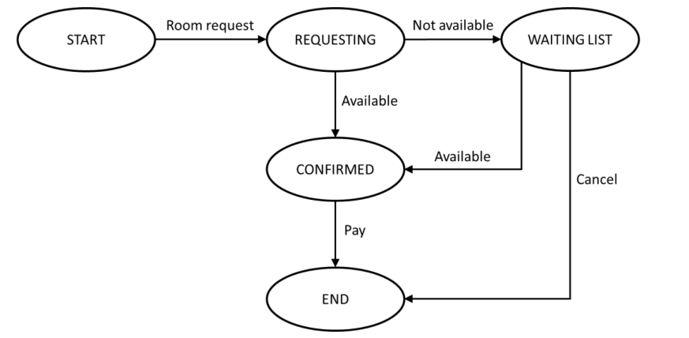
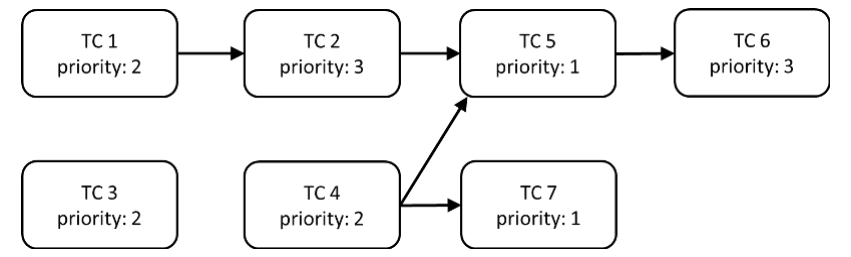

# ISTQB CTFL v4.0 Sample Exam C v1.6

## Question 1

- **Points:** 1 | **LO:** FL-1.1.1 | **K-Level:** K1 | **Select:** 1

Which of the following is a typical test objective?

**Options:**

- **a)** Validating that documented requirements are met
- **b)** Causing failures and identifying defects
- **c)** Initiating errors and identifying root causes
- **d)** Verifying the test object meets user expectations

**Correct answer:** b

**Explanations:**

- **a)** Is not correct. Validating that documented requirements are met is incorrect as validation is concerned with meeting user requirements and expectations, while verification is concerned with meeting specified requirements, so this would be correct if we replaced ‘validating’ with ‘verifying’
- **b)** Is correct. Causing failures and identifying defects is probably the most common objective of dynamic testing
- **c)** Is not correct. Initiating errors and identifying root causes is incorrect because testers do not initiate errors, they try to cause failures. Errors are typically made by developers (and cannot really be initiated) and result in defects, which testers attempt to identify either directly through static testing or indirectly through failures with dynamic testing. Identifying root causes is useful but is part of debugging, which is a separate activity from testing
- **d)** Is not correct. Verifying the test object meets user expectations is incorrect as verification is concerned with checking specified (documented) requirements are met, while validation is concerned with meeting user requirements and expectations, so this would be correct if we replaced ‘verifying’ with ‘validating’

---

## Question 2

- **Points:** 1 | **LO:** FL-1.1.2 | **K-Level:** K2 | **Select:** 1

Which of the following statements BEST describes the difference between testing and debugging?

**Options:**

- **a)** Testing causes failures while debugging fixes failures
- **b)** Testing is a negative activity while debugging is a positive activity
- **c)** Testing determines that defects exist while debugging removes defects
- **d)** Testing finds the cause of defects while debugging fixes the cause of defects

**Correct answer:** c

**Explanations:**

- **a)** Is not correct. Dynamic testing does cause failures (from which defects can then be located and fixed). However, debugging is concerned with locating defects and fixing these defects. Therefore, debugging does not fix failures
- **b)** Is not correct. Both testing and debugging contribute to improving the quality of the test object, so both should be considered positively. Debugging is generally considered to be a positive activity as it is fixing something. Dynamic testing does involve intentionally causing the test object to fail, which is why some people consider it a negative activity, but that is a very narrow view (and not one typically held by testers). Both positive and negative test cases are possible. Positive test cases check that the test object correctly performs what it is supposed to do, while negative testing checks that the test object does not do what it is not supposed to do
- **c)** Is correct. Testing determines that defects exist either directly through observation of the defect in reviews (or by a tool in static analysis), or indirectly by causing a failure in dynamic testing. Debugging is a separate activity from testing (normally performed by developers) and is concerned with locating defects (only for dynamic testing) and fixing the defects
- **d)** Is not correct. The causes of defects are typically human errors. Testing finds defects either directly through static testing, or indirectly by causing failures in dynamic testing, and debugging fixes defects. So, testing does not find the cause of defects and debugging does not fix the causes of defects

---

## Question 3

- **Points:** 1 | **LO:** FL-1.3.1 | **K-Level:** K2 | **Select:** 1

The ‘absence-of-defects fallacy’ is one of the principles of testing. Which of the following is an example of addressing this principle in practice?

**Options:**

- **a)** Explaining that it is not possible for testing to show the absence of defects
- **b)** Supporting the end users to perform acceptance testing
- **c)** Ensuring that no implementation defects remain in the delivered system
- **d)** Modifying tests that cause no failures to ensure few defects remain

**Correct answer:** b

**Rationale:**

The ‘absence-of-defects fallacy’ is concerned with the idea that ensuring
correctness in accordance with the requirements (i.e., verifying the absence
of implementation defects) does not guarantee user satisfaction with the
system. To address this it is also necessary to validate that the system
meets users' needs and expectations, fulfills business objectives, and
outperforms competing systems.

**Explanations:**

- **a)** Is not correct. The ‘testing shows the presence, not the absence of defects’ principle explains that while testing can detect the existence of defects in the test object, it is not possible to demonstrate that there are no defects and, therefore, guarantee its correctness. Therefore, explaining that it is not possible for testing to show the absence of defects would partially address this principle, not the ‘absence-of- defects’ fallacy
- **b)** Is correct. By supporting the end user to perform acceptance testing it should be possible to validate that the system meets users' needs and expectations
- **c)** Is not correct. It is not possible to ensure that no implementation defects remain in the delivered system as the ‘testing shows the presence, not the absence of defects’ principle explains that while testing can detect the existence of defects in the test object, it is not possible to demonstrate that there are no defects and, therefore, guarantee its correctness
- **d)** Is not correct. Modifying tests that cause no failures to ensure few defects remain is one way to address the ‘tests wear out’ principle. This principle is concerned with the idea that repeating identical tests on unaltered code is unlikely to uncover novel defects and therefore, modifying tests may be essential. This will not validate that the system meets users' needs and expectations

---

## Question 4

- **Points:** 1 | **LO:** FL-1.4.1 | **K-Level:** K2 | **Select:** 2

Which of the following test activities are MOST likely to involve the application of boundary value analysis and equivalence partitioning?

**Options:**

- **a)** Test implementation
- **b)** Test design
- **c)** Test execution
- **d)** Test monitoring
- **e)** Test analysis

**Correct answer:** b, e

**Rationale:**

Given the following description of test analysis:
To identify the features that require testing, the test basis is analyzed and
defined as test conditions, which are then prioritized along with related
risks. The systematic identification of test conditions as coverage items
often involves using test techniques both during test analysis and as part of
the test design activity.
From the above description, it can be seen that test techniques are often
used in the test analysis and test design activities. Boundary value analysis
and equivalence partitioning are test techniques.

**Explanations:**

- **a)** Is not correct. Test implementation is not likely to involve the use of test techniques as it is mostly concerned with assembling test cases into test procedures, while test techniques create test cases
- **b)** Is correct. Test design is likely to involve the use of test techniques to create test cases from test conditions and coverage items
- **c)** Is not correct. Test execution is not likely to involve the use of test techniques as it is mostly concerned with executing test procedures (and so test cases), while test techniques create test cases
- **d)** Is not correct. Test monitoring is not likely to involve the use of test techniques. Test monitoring is mostly concerned with ongoing checks to ensure the plan is being followed, while test techniques create test cases
- **e)** Is correct. Test analysis is likely to involve the use of test techniques to identify test conditions

---

## Question 5

- **Points:** 1 | **LO:** FL-1.4.3 | **K-Level:** K2 | **Select:** 1

Given the following testware:
1. Coverage items
2. Change requests
3. Test execution schedule
4. Prioritized test conditions And the following test activities
A. Test analysis
B. Test design
C. Test implementation
D. Test completion Which of the following BEST shows the testware produced by the activities?

**Options:**

- **a)** 1B, 2D, 3C, 4A
- **b)** 1B, 2D, 3A, 4C
- **c)** 1D, 2C, 3A, 4B
- **d)** 1D, 2C, 3B, 4A

**Correct answer:** a

**Rationale:**

Considering each of the listed test activities and their output testware:
A. Test analysis - prioritized test conditions (4) (e.g., acceptance
criteria), and defect reports for defects identified in the test basis
B. Test design - prioritized test cases, test charters, coverage items
(1), test data requirements, and test environment requirements
C. Test implementation - test procedures, automated test scripts,
test suites, test data, test execution schedule (3), and test
environment elements such as stubs, drivers, simulators, and
service virtualizations
D. Test completion - test completion report, documented lessons
learned, action items for improvement, and change requests (2)
(as product backlog items)
Thus:

**Explanations:**

- **a)** Is correct. The correct match is: 1B, 2D, 3C, 4A
- **b)** Is not correct
- **c)** Is not correct
- **d)** Is not correct

---

## Question 6

- **Points:** 1 | **LO:** FL-1.4.5 | **K-Level:** K2 | **Select:** 1

Which of the following statements about the different testing roles is MOST likely to be CORRECT?

**Options:**

- **a)** In Agile software development, the test management role is the primary responsibility of the team, while the testing role is primarily the responsibility of a single individual from outside the team
- **b)** The testing role is primarily responsible for test monitoring and test control, while the test management role is primarily responsible for test planning and test completion
- **c)** In Agile software development, test management activities that span multiple teams are handled by a test manager outside the team, while some test management tasks are handled by the team itself
- **d)** The test management role is primarily responsible for test analysis and test design, while the testing role is primarily responsible for test implementation and test execution

**Correct answer:** c

**Explanations:**

- **a)** Is not correct. Although it is correct to say that in Agile software development, some of the test management tasks may be handled by the Agile team itself, the testing role is not primarily the responsibility of a single individual from outside the team. Instead the testing is more likely to be performed by various team members following the whole- team approach
- **b)** Is not correct. The test management role primarily involves activities related to test planning, test monitoring and test control, and test completion. So, although this statement is partially correct, it is wrong to say that the testing role is primarily responsible for test monitoring and test control
- **c)** Is correct. In Agile software development, some of the test management tasks may be handled by the Agile team itself. However, for test activities that span multiple teams within an organization, test managers outside of the development team may perform these tasks
- **d)** Is not correct. The test management role primarily involves activities related to test planning, test monitoring and test control, and test completion, while the testing role is primarily responsible for the technical and engineering aspects of testing, such as test analysis, test design, test implementation, and test execution. Thus the test management role is not normally responsible for test analysis and test design, although it is correct to say that the testing role is primarily responsible for test implementation and test execution

---

## Question 7

- **Points:** 1 | **LO:** FL-1.5.2 | **K-Level:** K1 | **Select:** 1

Which of the following is an advantage of the whole-team approach?

**Options:**

- **a)** Teams with no testers
- **b)** Improved team dynamics
- **c)** Specialist team members
- **d)** Larger team sizes

**Correct answer:** b

**Explanations:**

- **a)** Is not correct. In the whole-team approach, testers play a vital role by sharing their testing expertise with the team and guiding product development. They collaborate with other team members to achieve the desired quality levels and work with business representatives to create acceptance tests. Testers also partner with developers to determine the optimal test strategy and test automation approaches
- **b)** Is correct. By leveraging the diverse skill sets of each team member most effectively, the whole-team approach fosters superior team dynamics, promotes robust communication and collaboration, and generates a synergistic effect that benefits the entire project
- **c)** Is not correct. The whole-team approach allows any team member with the requisite skills and knowledge to undertake any task, thus specialist team members are not an advantage of this approach
- **d)** Is not correct. There is no specific guidance on the optimum size of teams using the whole-team approach, and there is no suggestion that larger teams are better

---

## Question 8

- **Points:** 1 | **LO:** FL-1.5.3 | **K-Level:** K2 | **Select:** 1

Which of the following statements about the independence of testing is CORRECT?

**Options:**

- **a)** Independent testers will find defects due to their different technical perspective from developers, but their independence may lead to an adversarial relationship with the developers
- **b)** Developers’ familiarity with their own code means they only find a few defects in it, however their shared software background with testers means these defects would also be found by the testers
- **c)** Independent testing requires testers who are outside the developer’s team and ideally from outside the organization, however these testers find it difficult to understand the application domain
- **d)** Testers from outside the developer’s team are more independent than testers from within the team, but the testers from within the team are more likely to be blamed for delays in product release

**Correct answer:** a

**Explanations:**

- **a)** Is correct. The primary benefit of independence of testing is that testers are more likely to identify different types of failures and defects compared to developers, due to their varied backgrounds, technical viewpoints, and potential biases, including cognitive bias. However, the main disadvantage of independence of testing is that testers may become isolated from the development team, leading to communication problems, a lack of collaboration, and potentially an adversarial relationship, with testers being blamed for delays and bottlenecks in the release process
- **b)** Is not correct. A developer’s familiarity with the code does not mean that they rarely find defects in it, instead this familiarity means they can efficiently find many defects in their own code. And, rather than developers and testers having a shared background, developers having a different background to testers is normally cited as the reason that testers and developers find different kinds of defects
- **c)** Is not correct. Testing can be performed at different levels of independence, ranging from no independence for the author to very high independence for testers from outside the organization. In most projects, multiple levels of independence are utilized, with developers performing component testing and component integration testing, the test team performing system testing and system integration testing, and business representatives performing acceptance testing. So, testers can be in the developer’s team and do not need to come from outside the organization. Knowledge of the application domain will change from case to case and is not dependent on the level of independence
- **d)** Is not correct. Testing can be performed at different levels of independence, ranging from no independence for the author to very high independence for testers from outside the organization, with testers from outside the developer’s team generally more independent than testers from within the team. However, there is more reason to believe that testers from outside the team are likely to be more isolated from the developers and so are more likely to be blamed for delays in product release

---

## Question 9

- **Points:** 1 | **LO:** FL-2.1.2 | **K-Level:** K1 | **Select:** 1

Which of the following is a good testing practice that applies to all software development lifecycles?

**Options:**

- **a)** For each test level, there is a corresponding development level
- **b)** For each test objective, there is a corresponding development objective
- **c)** For every test activity, there is a corresponding user activity
- **d)** For every development activity, there is a corresponding test activity

**Correct answer:** d

**Explanations:**

- **a)** Is not correct. Quality control applies to all development activities, meaning that every software development activity has a corresponding test activity. However, here we are attempting to equate test levels with development levels, and, although we know what is meant by ‘test levels’, there is no common understanding of the term ‘ development level’
- **b)** Is not correct. Every software development activity has a corresponding test activity; however test objectives are quite different. For instance, there might be a test objective of ensuring that a test object adheres to a contractual requirement that a certain type of testing must be performed before delivery. In this case there is no reason for there to be a corresponding development objective
- **c)** Is not correct. Quality control applies to all development activities, meaning that every software development activity has a corresponding test activity. However, the same symmetry does not apply to testing and user activities. For instance, for some systems it is difficult to even identify the end users. Also, some test activities are focused on developers (e.g., testing for ease of maintainability), which has no user aspect to it
- **d)** Is correct. Quality control applies to all development activities, meaning that every software development activity has a corresponding test activity

---

## Question 10

- **Points:** 1 | **LO:** FL-2.1.3 | **K-Level:** K1 | **Select:** 1

Which of the following is an example of a test-first approach to development?

**Options:**

- **a)** Component Test-Driven Development
- **b)** Integration Test-Driven Development
- **c)** System Test-Driven Development
- **d)** Acceptance Test-Driven Development

**Correct answer:** d

**Explanations:**

- **a)** Is not correct. Component Test-Driven Development is not a correct example of a test-first approach to development
- **b)** Is not correct. Integration Test-Driven Development is not a correct example of a test-first approach to development
- **c)** Is not correct. System Test-Driven Development is not a correct example of a test-first approach to development
- **d)** Is correct. Acceptance Test-Driven Development (ATDD) is a well- known example of a test-first approach to development

---

## Question 11

- **Points:** 1 | **LO:** FL-2.1.5 | **K-Level:** K2 | **Select:** 1

Which of the following provides the BEST description of shift-left?

**Options:**

- **a)** When agreed by the developers, manual activities on the left-hand side of the test process are automated to support the principle of ‘early testing saves time and money’
- **b)** Where cost-effective, test activities are moved earlier in the software development lifecycle (SDLC) to reduce the total cost of quality by reducing the number of defects found later in the SDLC
- **c)** When they have spare time available, testers are required to automate tests for regression testing, starting with component tests and component integration tests
- **d)** When available, testers are trained to perform tasks early in the SDLC to allow more test activities to be automated later in the SDLC

**Correct answer:** b

**Explanations:**

- **a)** Is not correct. Practices involved in shift left are aimed at implementing more test activities in the early phases of the software development life cycle (SDLC), portraying the SDLC as moving from left to right. There is no such thing as the left-hand side of the test process
- **b)** Is correct. Shift left emphasizes the importance of starting testing earlier in the SDLC. Implementing shift left testing necessitates additional training, and increased effort and costs during the early phases of the SDLC, nevertheless, overall savings should be higher
- **c)** Is not correct. Although automated component tests and component integration tests for regression testing are generally valuable, the creation of these tests is normally the responsibility of the developers, and if a continuous integration/continuous delivery (CI/CD) approach is followed, then these tests will have been submitted with the code. In some situations the tester may automate tests for regression testing, and sometimes even for component tests and component integration tests, however this is not part of shift left which moves testing earlier in the SDLC
- **d)** Is not correct. Training testers to perform tasks early in the SDLC would support a shift left approach by emphasizing the importance of starting testing earlier in the SDLC. However, automating more test activities to be performed later in the SDLC is not part of shift-left

---

## Question 12

- **Points:** 1 | **LO:** FL-2.1.6 | **K-Level:** K2 | **Select:** 1

Which of the following is LEAST likely to occur as a result of a retrospective?

**Options:**

- **a)** The quality of future test objects improves by identifying improvements in development practices
- **b)** Test efficiency improves by speeding up the configuration of test environments through automation
- **c)** End users’ understanding of the development and test processes is improved
- **d)** Automated test scripts are enhanced through feedback from developers

**Correct answer:** c

**Explanations:**

- **a)** Is not correct. One of the purposes of retrospectives is to identify potential process improvements, which, if put into practice, should result in the quality of future outputs of the development process (test objects) being higher. So, this is likely to occur as a result of a retrospective
- **b)** Is not correct. A benefit of retrospectives for testing includes increased test efficiency through process improvements. So, this is likely to occur as a result of a retrospective
- **c)** Is correct. Participants at retrospectives typically include testers, developers, architects, product owners, and business analysts, but end users are rarely invited or attend these meetings – and they are also unlikely to receive any reports from these meetings. So, it is very unlikely that they will learn and understand more about the development and test processes through retrospectives
- **d)** Is not correct. A benefit of retrospectives for testing includes improved quality of testware (including automated test scripts) through joint reviews with developers. So, this is likely to occur as a result of a retrospective

---

## Question 13

- **Points:** 1 | **LO:** FL-2.2.1 | **K-Level:** K2 | **Select:** 1

Which of the following test levels is MOST likely being performed if the testing is focused on validation and is not being performed by testers?

**Options:**

- **a)** Component testing
- **b)** Component integration testing
- **c)** System integration testing
- **d)** Acceptance testing

**Correct answer:** d

**Explanations:**

- **a)** Is not correct. Component testing (also called unit testing) involves testing individual components in isolation and is mostly verification against a specification, rather than validation against user needs. However, this testing is not normally performed by testers, as developers usually carry out this testing in their development environment
- **b)** Is not correct. Component integration testing involves testing the interfaces and interactions between components and is mostly verification against a specification, rather than validation against user needs. However, this testing is not normally performed by testers, as developers usually carry out this testing
- **c)** Is not correct. System integration testing examines the interfaces with other systems and external services and is mostly verification against a specification, rather than validation against user needs. This type of testing is also most often performed by testers
- **d)** Is correct. Acceptance testing focuses on validating that the system meets the user's business needs and is ready for deployment. Ideally, this testing is carried out by the end users

---

## Question 14

- **Points:** 1 | **LO:** FL-2.2.3 | **K-Level:** K2 | **Select:** 1

The navigation system software has been updated due to it suggesting routes that break traffic laws, such as driving the wrong way down one-way streets. Which of the following BEST describes the testing that will be performed?

**Options:**

- **a)** Only confirmation testing
- **b)** Confirmation testing then regression testing
- **c)** Only regression testing
- **d)** Regression testing then confirmation testing

**Correct answer:** b

**Explanations:**

- **a)** Is not correct. Confirmation testing to check that the updates have resulted in a correct implementation is necessary, however, it would then be sensible to perform regression testing to ensure that no defects have been introduced or uncovered in unchanged areas of the system
- **b)** Is correct. Confirmation testing will check that the updates have resulted in a correct implementation, and then regression testing will be used to ensure that no defects have been introduced or uncovered in unchanged areas of the system
- **c)** Is not correct. Regression testing should be used to ensure that no defects have been introduced or uncovered in unchanged areas of the system when the update was made, however it is also necessary to perform confirmation testing that will check that the updates have resulted in a correct implementation
- **d)** Is not correct. Confirmation testing will check that the updates have resulted in a correct implementation, and regression testing will be used to ensure that no defects have been introduced or uncovered in unchanged areas of the system. However, when performed (i.e., when an update needs to be tested), confirmation testing precedes regression testing

---

## Question 15

- **Points:** 1 | **LO:** FL-3.1.3 | **K-Level:** K2 | **Select:** 1

Given the following example defects:
i. Two different parts of the design specification disagree due to the complexity of the design
ii. A response time is too long and so makes users lose patience
iii. A path in the code cannot be reached during execution
iv. A variable is declared but never subsequently used in the program
v. The amount of memory needed by the program to generate a report is too high Which of the following BEST identifies example defects that could be found by static testing (rather than dynamic testing)?

**Options:**

- **a)** ii, v
- **b)** iii, v
- **c)** i, ii, iv
- **d)** i, iii, iv

**Correct answer:** d

**Rationale:**

Considering each of the listed example defects:
i. Two different parts of the design specification disagree due to the
complexity of the design – this is an example of a specification
defect, which includes inconsistencies, ambiguities,
contradictions, omissions, inaccuracies, and duplications, which
can most easily be found by static testing
ii. A response time is too long and so makes users lose patience –
this is an example of a response time defect, which can only be
detected in practice by executing the program and measuring the
response time, which can most easily be found by dynamic
testing
iii. A path in the code cannot be reached during execution - this is an
example of a coding defect, which includes variables with
undefined values, undeclared variables, duplicated or
unreachable code, and excessive code complexity, which can
most easily be found by static testing
iv. A variable is declared but never subsequently used in the
program - this is an example of a coding defect, which includes
variables with undefined values, undeclared variables, duplicated
or unreachable code, and excessive code complexity, which can
most easily be found by static testing
v. The amount of memory needed by the program to generate a
report is too high – this is an example of a performance defect,
which can only be detected in practice by executing the program
and measuring the memory used, which can most easily be found
by dynamic testing
Thus:

**Explanations:**

- **a)** Is not correct
- **b)** Is not correct
- **c)** Is not correct
- **d)** Is correct. The correct match for static testing is i, iii, and iv

---

## Question 16

- **Points:** 1 | **LO:** FL-3.2.1 | **K-Level:** K1 | **Select:** 1

Which of the following is a benefit of early and frequent stakeholder feedback?

**Options:**

- **a)** Changes to requirements are understood and implemented earlier
- **b)** It ensures business stakeholders understand user requirements
- **c)** It allows product owners to change their requirements as often as they want
- **d)** End users are told which requirements will not be implemented prior to release

**Correct answer:** a

**Explanations:**

- **a)** Is correct. Obtaining feedback from stakeholders early and often in the software development process can be highly beneficial. It facilitates early communication of potential quality issues, can prevent misunderstandings about requirements, and ensures that any changes in stakeholder requirements are understood and implemented sooner
- **b)** Is not correct. The feedback is from stakeholders, so providing feedback is unlikely to improve their understanding of their own user requirements
- **c)** Is not correct. Obtaining feedback from stakeholders early and often in the software development process can be highly beneficial. It facilitates early communication of potential quality issues, can prevent misunderstandings about requirements, and ensures that any changes in stakeholder requirements are understood and implemented sooner. However, because changes in requirements can be understood and implemented sooner, it does not mean that unlimited changes to requirements are encouraged
- **d)** Is not correct. The feedback is from stakeholders and does not cover communication to them. Communications with end users could include telling them about which requirements will not be implemented prior to release, but ideally this should not happen at all

---

## Question 17

- **Points:** 1 | **LO:** FL-3.2.4 | **K-Level:** K2 | **Select:** 1

Given the following review types:
1. Technical review
2. Informal review
3. Inspection
4. Walkthrough And the following descriptions:
A. Includes objectives such as gaining consensus, generating new ideas, and motivating authors to improve
B. Includes objectives such as educating reviewers, gaining consensus, generating new ideas and detecting potential defects
C. The main objective is detecting potential defects and it requires metrics collection to support process improvement
D. The main objective is detecting potential defects and it generates no formal documented output Which of the following BEST matches the review types and the descriptions?

**Options:**

- **a)** 1A, 2B, 3C, 4D
- **b)** 1A, 2D, 3C, 4B
- **c)** 1B, 2C, 3D, 4A
- **d)** 1C, 2D, 3A, 4B

**Correct answer:** b

**Rationale:**

Considering each of the listed review types:
1. Technical review - This type of review is performed by technically
qualified reviewers and led by a moderator. The objectives are to
gain consensus and make decisions on technical problems while
also evaluating quality and building confidence in the work
product, generating new ideas, motivating and enabling authors to
improve, and detecting anomalies
2. Informal review - The main objective is to detect anomalies. The
process is not defined and does not require formal documented
output
3. Inspection - This is the most formal review type, and it follows the
complete generic review process. The primary objective is to find
the most anomalies, and other objectives include evaluating
quality and building confidence in the work product, motivating
and enabling authors to improve, and collecting metrics that can
be used to enhance the software development lifecycle (SDLC),
including the inspection process. The author cannot act as the
review leader or scribe
4. Walkthrough - Led by the author, this type of review serves
various objectives such as evaluating quality and building
confidence in the work product, educating reviewers, gaining
consensus, generating new ideas, motivating and enabling
authors to improve, and detecting anomalies. Reviewers might
perform an individual review before the walkthrough, but this is
not mandatory
A. Includes objectives such as gaining consensus, generating new
ideas, and motivating authors to improve
B. Includes objectives such as educating reviewers, gaining
consensus, generating new ideas and detecting anomalies
C. The main objective is detecting anomalies and it requires metrics
collection to support process improvement
D. The main objective is detecting anomalies and it generates no
formal documented output
Thus:

**Explanations:**

- **a)** Is not correct
- **b)** Is correct.
- **c)** Is not correct
- **d)** Is not correct

---

## Question 18

- **Points:** 1 | **LO:** FL-3.2.5 | **K-Level:** K1 | **Select:** 1

Which of the following is a factor that contributes to a successful review?

**Options:**

- **a)** Ensure management participate as reviewers
- **b)** Split large work products into smaller parts
- **c)** Set reviewer evaluation as an objective
- **d)** Plan to cover one document per review

**Correct answer:** b

**Explanations:**

- **a)** Is not correct. To ensure successful reviews, it is important to secure management's support for the review process. However that does not mean that they should participate as reviewers
- **b)** Is correct. To ensure successful reviews, it's important to break the work product into parts that are small enough to be reviewed in a reasonable timescale to prevent reviewers from losing focus during individual reviews or review meetings
- **c)** Is not correct. To ensure successful reviews, it's important to clearly define objectives and measurable exit criteria, without evaluating participants
- **d)** Is not correct. To ensure successful reviews, it's important to break down the review into smaller chunks to prevent reviewers from losing focus during individual reviews or review meetings. So you should not plan to cover one document per review

---

## Question 19

- **Points:** 1 | **LO:** FL-4.1.1 | **K-Level:** K2 | **Select:** 1

What is the MAIN difference between black-box test techniques and experience-based test techniques?

**Options:**

- **a)** The test object
- **b)** The test level at which the test technique is used
- **c)** The test basis
- **d)** The software development lifecycle (SDLC) in which the test technique can be used

**Correct answer:** c

**Explanations:**

- **a)** Is not correct. In most cases both black-box test techniques and experience-based test techniques can be used for the same test objects
- **b)** Is not correct. Both black-box test techniques and experience-based test techniques can be used at all test levels
- **c)** Is correct. Black-box test techniques (also known as specification-based techniques) are based on an analysis of the specified behavior of the test object without reference to its internal structure. So, the test basis is usually a specification. Experience-based test techniques effectively use the knowledge and experience of testers for the design and implementation of test cases. This means that the tester, when designing tests, may not use the specification at all
- **d)** Is not correct. Experience-based test techniques can detect defects that may be missed using black-box (and white-box) test techniques. Hence, experience-based test techniques are complementary to black-box test techniques and white-box test techniques and both black-box test techniques and experience-based test techniques can be used in all SDLCs

---

## Question 20

- **Points:** 1 | **LO:** FL-4.2.1 | **K-Level:** K3 | **Select:** 1

You are testing a PIN validator, which accepts valid PINs and rejects invalid PINs. A PIN is a sequence of digits. A PIN is valid if it consists of four digits, which are not all the same digit. You have identified the following valid equivalence partitions:
Variable: PIN code length
• The partition “length correct”                       - four-digit PINs
• The partition “length incorrect”                     - PINs with length other than 4 Variable: Number of different digits
• The partition “number of different digits correct”   - PINs with at least two different digits
• The partition “number of different digits incorrect” - PINs with all digits being the same Which of the following is the BEST set of input test data to cover the identified equivalence partitions?

**Options:**

- **a)** 12, 1111, 1234, 12345
- **b)** 1, 123, 1111, 1234
- **c)** 11, 12, 1111, 12345
- **d)** 123, 1222, 12345

**Correct answer:** a

**Explanations:**

- **a)** Is correct. • Value “12” covers “length incorrect, too few digits” • Value “1111” covers “length correct” and “number of different digits incorrect • Value “1234” again covers “length correct” and “number of different digits correct” • Value “12345” covers “length incorrect, too many digits”
- **b)** Is not correct. All partitions are covered, however it only covers the lower side of “length incorrect”
- **c)** Is not correct. There are no value covering “correct PIN”
- **d)** Is not correct. There are no value covering “number of different digits”

---

## Question 21

- **Points:** 1 | **LO:** FL-4.2.2 | **K-Level:** K3 | **Select:** 1

A developer was asked to implement the following business rule:
INPUT: value (integer number) IF (value ≤ 100 OR value ≥ 200) THEN write “value incorrect” ELSE write “value OK” You design the test cases using 2-value boundary value analysis.
Which of the following sets of test inputs achieves the greatest coverage?

**Options:**

- **a)** 100,             150,         200,          201
- **b)** 99,              100,         200,          201
- **c)** 98,              99,          100,          101
- **d)** 101,             150,         199,          200

**Correct answer:** d

**Rationale:**

The equivalence partitions are: {…, 99, 100}, {101, 102, …, 198, 199}, {200,
201, …}.
Thus, there are 4 boundary values, which are: 100, 101, 199 and 200.
In 2-value BVA, for each boundary value there are two coverage items (the
boundary value and its closest neighbor belonging to the adjacent partition).
As the closest neighbors are also boundary values in the adjacent partition,
then there are just four coverage items.
Thus:

**Explanations:**

- **a)** Is not correct. Only 100 and 200 are valid coverage items for 2-value BVA, so we achieve 50% coverage
- **b)** Is not correct. Only 100 and 200 are valid coverage items for 2-value BVA, so we achieve 50% coverage
- **c)** Is not correct. Only 100 and 101 are valid coverage items for 2-value BVA, so we achieve 50% coverage
- **d)** Is correct. 101, 199 and 200 are valid coverage items for 2-value BVA, so we achieve 75% coverage

---

## Question 22

- **Points:** 1 | **LO:** FL-4.2.3 | **K-Level:** K3 | **Select:** 1

You are working on a project to develop a system to analyze driving test results. You have been asked to design test cases based on the following decision table.
R1 | R2 | R3
C1: First attempt at the exam? - | - | F
C2: Theoretical exam passed? T | F | -
C3: Practical exam passed? T | - | F
Issue a driving license?   X Request additional driving lessons?                           X Request to take the exam again?                       X What test data will show that there are contradictory rules in the decision table?

**Options:**

- **a)** C1 = T, C2 = T, C3 = F
- **b)** C1 = T, C2 = F, C3 = T
- **c)** C1 = T, C2 = T, C3 = T and C1 = F, C2 = T, C3 = T
- **d)** C1 = F, C2 = F, C3 = F

**Correct answer:** d

**Explanations:**

- **a)** Is not correct. The combination (T, T, F) does not match any rule. This is an example of omission, not a contradiction
- **b)** Is not correct. The combination (T, F, T) matches only one column, R2, so there is no contradiction
- **c)** Is not correct. Both combinations (T, T, T) and (F, T, T) match only one column, R1, so there is no contradiction
- **d)** Is correct. The combination (F, F, F) matches both R2 and R3, but R2 and R3 have different actions, so this shows a contradiction between R2 and R3.

---

## Question 23

- **Points:** 1 | **LO:** FL-4.2.4 | **K-Level:** K3 | **Select:** 1

You are designing test cases based on the following state transition diagram:
What is the MINIMUM number of test cases required to achieve 100% valid transitions coverage?

**Options:**

- **a)** 3
- **b)** 2
- **c)** 5
- **d)** 6

**Correct answer:** a

**Rationale:**

The following three transitions:
“REQUESTING -> CONFIRMED”
“WAITING LIST -> CONFIRMED”
“WAITING LIST -> END”
cannot appear in the same test case, which suggests that at least three test
cases are required. All the other transitions can appear in combination with
one or more of these three transitions, so we need a minimum of three test
cases. In fact, only three sequences are possible:
TC1: START (Room request) → REQUESTING (Available) →
CONFIRMED (Pay) → END
TC2: START (Room request) → REQUESTING (Not available) →
WAITING LIST (Available) → CONFIRMED (Pay) → END
TC3: START (Room request) → REQUESTING (Not available) →
WAITING LIST (Cancel) → END
Thus:

**Explanations:**

- **a)** Is correct
- **b)** Is not correct
- **c)** Is not correct
- **d)** Is not correct

---

## Question 24

- **Points:** 1 | **LO:** FL-4.3.2 | **K-Level:** K2 | **Select:** 1

You want to apply branch testing to the code represented by the following control flow graph.
How many coverage items do you need to test?

**Options:**

- **a)** 2
- **b)** 4
- **c)** 8
- **d)** 7

**Correct answer:** c

**Rationale:**

In branch testing the coverage items are branches, which are represented
by the edges of a control flow graph. There are 8 edges in the control flow
graph.
Thus:

**Explanations:**

- **a)** Is not correct
- **b)** Is not correct
- **c)** Is correct
- **d)** Is not correct

---

## Question 25

- **Points:** 1 | **LO:** FL-4.3.3 | **K-Level:** K2 | **Select:** 1

How can white-box testing be useful in support of black-box testing?

**Options:**

- **a)** White-box coverage measures can help testers evaluate black-box tests in terms of the code coverage achieved by these black-box tests
- **b)** White-box coverage analysis can help testers identify unreachable fragments of the source code
- **c)** Branch testing subsumes black-box test techniques, so achieving full branch coverage guarantees achieving full coverage of any black-box technique
- **d)** White-box test techniques can provide coverage items for black-box techniques

**Correct answer:** a

**Explanations:**

- **a)** Is correct. Performing only black-box testing does not provide a measure of actual code coverage. White-box coverage measures provide an objective measurement of coverage and provide the necessary information to allow additional tests to be generated to increase this coverage, and subsequently increase confidence in the code
- **b)** Is not correct. This statement is correct, but it has nothing to do with black-box testing
- **c)** Is not correct. In general there are no relationships between white-box test techniques and black-box test techniques
- **d)** Is not correct. White-box test techniques are used to design tests based on the test object itself, while black-box test techniques are used to design tests based on the specification. Therefore, there is no relation between coverage items derived from these two types of test techniques

---

## Question 26

- **Points:** 1 | **LO:** FL-4.4.1 | **K-Level:** K2 | **Select:** 1

Consider the following list:
• Correct input not accepted
• Incorrect input accepted
• Wrong output format
• Division by zero What test technique is MOST PROBABLY used by the tester who uses this list when performing testing?

**Options:**

- **a)** Exploratory testing
- **b)** Fault attack
- **c)** Checklist-based testing
- **d)** Boundary value analysis

**Correct answer:** b

**Explanations:**

- **a)** Is not correct. Exploratory testing uses test charters, not a list of possible defects/failures. Although exploratory testing can incorporate the use of other test techniques, in this case a fault attack is the most likely option
- **b)** Is correct. This is a list of possible failures. Fault attacks are a methodical approach to the implementation of error guessing and require the tester to create or acquire a list of possible errors, defects and failures, and to design tests that will identify defects associated with the errors, expose the defects, or cause the failures
- **c)** Is not correct. The tester is using a checklist of items to support their testing. Both error guessing and checklist-based testing use such lists, however, the list here is of possible failures, not test conditions, and so the MOST PROBABLE test technique is fault attack, which focuses on errors, defects and failures
- **d)** Is not correct. BVA is based on an analysis of boundary values of equivalence partitions. The above list does not mention equivalence partitions or their boundaries

---

## Question 27

- **Points:** 1 | **LO:** FL-4.4.3 | **K-Level:** K2 | **Select:** 1

Which of the following BEST describes how using checklist-based testing can result in increased coverage?

**Options:**

- **a)** Checklist items can be defined at a sufficiently low level of detail, so the tester can implement and execute detailed test cases based on these items
- **b)** Checklists can be automated, so each time an automated test execution covers the checklist items, it results in additional coverage
- **c)** Each checklist item should be tested separately and independently, so the elements cover different areas of the software
- **d)** Two testers designing and executing tests based on the same high-level checklist items will typically perform the testing in slightly different ways

**Correct answer:** d

**Explanations:**

- **a)** Is not correct. Although it is true that the tester can implement and execute detailed test cases based on the checklist, it does not explain how this would result in increased coverage
- **b)** Is not correct. Checklist items should not be automated. But even if they are, the automated test scripts always execute the tests in the same way, which usually does not result in increased coverage
- **c)** Is not correct. It is true that each checklist item should be tested separately and independently. But this impacts the test execution order and does not impact the achieved coverage, and so does not result in increased coverage
- **d)** Is correct. If the checklists are high-level, some variability in the actual testing is likely to occur, resulting in potentially greater coverage but less repeatability. If two testers follow a checklist of high-level items, each of them may use different test data, test steps, etc. This way, one tester will probably cover some areas not covered by the other tester and this will result in increased coverage

---

## Question 28

- **Points:** 1 | **LO:** FL-4.5.2 | **K-Level:** K2 | **Select:** 1

Which of the following provides the BEST example of a scenario-oriented acceptance criterion?

**Options:**

- **a)** The application must allow users to delete their account and all associated data upon request
- **b)** When a customer adds an item to their cart and proceeds to checkout, they should be prompted to log in or create an account if they haven’t already done so
- **c)** IF (contain(product(23).Name, cart.products())) THEN return FALSE
- **d)** The website must comply with the ICT Accessibility 508 Standards and ensure that all content is accessible to users with disabilities

**Correct answer:** b

**Explanations:**

- **a)** Is not correct. This acceptance criterion describes what rules or regulations the system must adhere to (in this case, the right to be forgotten). This is an example of a rule-oriented acceptance criterion
- **b)** Is correct. This acceptance criterion describes an example scenario that must be realized by the system. This is an example of a scenario- oriented acceptance criterion
- **c)** Is not correct. This sentence looks more like a line of code that implements some business rule. Acceptance criteria should be written in collaboration with business representatives, and therefore should be written in language they understand. This sentence will most likely be unintelligible to these stakeholders
- **d)** Is not correct. This acceptance criterion describes what rules or regulations the system must adhere to and how compliance will be ensured. Therefore, this is an example of a rule-oriented acceptance criterion, not a scenario-based acceptance criterion

---

## Question 29

- **Points:** 1 | **LO:** FL-4.5.3 | **K-Level:** K3 | **Select:** 1

You are using acceptance test-driven development and designing test cases based on the following user story:
As a Regular or Special user, I want to be able to use my electronic floor card, to access specific floors.
Acceptance Criteria:
AC1: Regular users have access to floors 1 to 3 AC2: Floor 4 is only accessible to Special users AC3: Special users have all the access rights of Regular users Which test case is the MOST reasonable one to test AC3?

**Options:**

- **a)** Check that a Regular user can access floors 1 and 3
- **b)** Check that a Regular user cannot access floor 4
- **c)** Check that a Special user can access floor 5
- **d)** Check that a Special user can access floors 1, 2 and 3

**Correct answer:** d

**Explanations:**

- **a)** Is not correct. We want to check that Special users have the rights of Regular users, so we need to test access rights for a Special user, not for a Regular user
- **b)** Is not correct. We want to check that Special users have the rights of Regular users, so we need to test access rights for a Special user, not for a Regular user
- **c)** Is not correct. There is no floor 5 described in the acceptance criteria. The test cases should not extend the scope of the user story. But even if we would like to perform negative testing, this test is not directly related to AC3
- **d)** Is correct. This is the way we can check if a Special user can access floors which are accessible to a Regular user

---

## Question 30

- **Points:** 1 | **LO:** FL-5.1.1 | **K-Level:** K2 | **Select:** 1

Which of the following is NOT a purpose of a test plan?

**Options:**

- **a)** To define test data and expected results for component tests and component integration tests
- **b)** To define as exit criteria from the component test level that “100% statement coverage and 100% branch coverage must be achieved”
- **c)** To describe what fields the test progress report shall contain and what should be the form of this report
- **d)** To explain why system integration testing will be excluded from testing, although the test strategy requires this test level

**Correct answer:** a

**Explanations:**

- **a)** Is correct. The test plan may include test data requirements (as part of the test approach), but not the detailed test data for test cases. Test data is part of the test cases, not the test plan. Also, it is usually impossible to define such data when the test plan is created, because it is not exactly known what the components will look like
- **b)** Is not correct. One of the purposes of a test plan is to help ensure that test activities will meet the established criteria, by including entry criteria and exit criteria. The code coverage criteria are an example of such criteria for the component test level
- **c)** Is not correct. Documentation templates are typical content of a test plan. This helps to facilitate communication between the stakeholders by defining a standard way of communicating or reporting
- **d)** Is not correct. One of the purposes of a test plan is to demonstrate that testing will adhere to the existing test policy and test strategy, or to explain why the testing will deviate from them. This is an example of explaining the deviation, regarding the test levels that will be (or will not be) followed

---

## Question 31

- **Points:** 1 | **LO:** FL-5.1.4 | **K-Level:** K3 | **Select:** 1

At the beginning of each iteration, the team estimates the amount of work (in person-days) they will need to complete during the iteration. Let E(n) be the estimated amount of work for iteration n, and let A(n) be the actual amount of work done in iteration n. From the third iteration, the team uses the following estimation model based on extrapolation:
3 ∗ 𝐴(𝑛 − 1) + 𝐴(𝑛 − 2) 𝐸(𝑛) = 4 The graph shows the estimated and actual amount of work for the first four iterations.
Estimated and actual effort (in person-days) 13 12 11 10 9 8 7 6 5 4 3 2 1 0
Iteration #1 | Iteration #2 | Iteration #3 | Iteration #4
Estimated   Actual What is the estimated amount of work for iteration #5?

**Options:**

- **a)** 10.5 person-days
- **b)** 8.25 person-days
- **c)** 6.5 person-days
- **d)** 9.4 person-days

**Correct answer:** c

**Rationale:**

From the graph we have:
A(4)=6 and A(3)=8 (the last two gray boxes).
From the formula we obtain:
E(5) = (3*A(4) + A(3)) / 4 = (3*6+8) / 4 = 26 / 4 = 6.5 person-days.
Thus:

**Explanations:**

- **a)** Is not correct
- **b)** Is not correct
- **c)** Is correct
- **d)** Is not correct

---

## Question 32

- **Points:** 1 | **LO:** FL-5.1.5 | **K-Level:** K3 | **Select:** 1

You are preparing a test execution schedule for executing seven test cases TC 1 to TC 7.
The following figure includes the priorities of these test cases (1=highest priority, 3 = lowest priority).
The figure also shows the dependencies between test cases using arrows. For instance, the arrow from TC 4 to TC 5 means that TC 5 can only be executed if TC 4 was previously executed.
Which test case should be executed sixth?

**Options:**

- **a)** TC 3
- **b)** TC 5
- **c)** TC 6
- **d)** TC 2

**Correct answer:** a

**Rationale:**

We want to run test cases according to their priorities, but we also need to
consider the dependencies.
If we only consider priorities, we want to first run TC 5 and TC 7 (highest
priority), then TC 1, TC 3, and TC 4, and finally TC 2 and TC 6 (lowest
priority).
However, in order to run TC 7, we need to first run TC 4.
In order to run TC 5, we need to run TC 4 and TC 2, but TC 2 is blocked by
TC 1, which should be run prior to TC 2.
So, in order to run priority 1 test cases as early as possible, the first five test
cases should be: TC 4 - TC 7 - TC 1 - TC 2 - TC 5.
Next, we need to run TC 3, because it has higher priority than TC 6.
Thus the full schedule will be TC 4 – TC 7 – TC 1 – TC 2 – TC 5 – TC 3 –
TC 6.
So, the sixth test case will be TC 3.
Thus:

**Explanations:**

- **a)** Is correct
- **b)** Is not correct
- **c)** Is not correct
- **d)** Is not correct

---

## Question 33

- **Points:** 1 | **LO:** FL-5.1.6 | **K-Level:** K1 | **Select:** 1

What does the test pyramid model show?

**Options:**

- **a)** That tests may have different priorities
- **b)** That tests may have different granularity
- **c)** That tests may require different coverage criteria
- **d)** That tests may depend on other tests

**Correct answer:** b

**Explanations:**

- **a)** Is not correct. The test pyramid model does not provide information about test priorities
- **b)** Is correct. The test pyramid model shows that different tests have different levels of granularity
- **c)** Is not correct. The test pyramid model is independent of coverage criteria
- **d)** Is not correct. Test pyramid model does not show any relations between different tests

---

## Question 34

- **Points:** 1 | **LO:** FL-5.1.7 | **K-Level:** K2 | **Select:** 1

What is the relationship between the testing quadrants, test levels and test types?

**Options:**

- **a)** Testing quadrants represent particular combinations of test levels and test types, defining their location in the software development lifecycle
- **b)** Testing quadrants describe the degree of granularity of individual test types performed at each test level
- **c)** Testing quadrants assign the test types that can be performed to the test levels
- **d)** Testing quadrants group test levels and test types by several criteria such as targeting specific stakeholders

**Correct answer:** d

**Explanations:**

- **a)** Is not correct. Testing quadrants group test levels and test types separately according to several criteria. They do not represent any combinations of test levels and test types and they are not related to any location within a software development lifecycle. Both test levels and test types are treated separately in the testing quadrants model
- **b)** Is not correct. Testing quadrants group test levels and test types according to several criteria. They do not describe the degree of granularity of individual test types performed at each test level. Such a model, regarding the test levels, is called the test pyramid
- **c)** Is not correct. The statement is wrong, because in general any test type can be performed at any test level
- **d)** Is correct. The testing quadrants group test levels, test types, test activities, test techniques and work products in Agile software development. In this model, tests can be business facing or technology facing. Tests can support the team (i.e., guide the development) or critique the product (i.e., measure its behavior against expectations). The combination of these two viewpoints determines the four quadrants

---

## Question 35

- **Points:** 1 | **LO:** FL-5.2.3 | **K-Level:** K2 | **Select:** 1

Which of the following is an example of how product risk analysis may influence the thoroughness and scope of testing?

**Options:**

- **a)** Continuous risk monitoring allows us to identify an emerging risk as soon as possible
- **b)** Risk identification allows us to implement risk mitigation activities and reduce the risk level
- **c)** The assessed risk level helps us to select the rigor of testing
- **d)** Risk analysis allows us to derive coverage items

**Correct answer:** c

**Explanations:**

- **a)** Is not correct. Risk monitoring is part of risk control, not risk analysis
- **b)** Is not correct. Risk identification itself does not allow us to implement risk mitigation activities. The mitigating actions are defined during the risk control phase
- **c)** Is correct. This is an example of how risk analysis influences the thoroughness and scope of testing
- **d)** Is not correct. Coverage items are derived using test techniques, not through risk analysis

---

## Question 36

- **Points:** 1 | **LO:** FL-5.3.2 | **K-Level:** K2 | **Select:** 1

Which of the following activities in the test process makes the MOST use of test progress reports?

**Options:**

- **a)** Test design
- **b)** Test completion
- **c)** Test analysis
- **d)** Test planning

**Correct answer:** b

**Explanations:**

- **a)** Is not correct. Test progress reports are mostly used during test monitoring and test control, and test completion, not during test design
- **b)** Is correct. A test completion report is prepared during test completion, when a project, test level, or test type is complete and when, ideally, its exit criteria have been met. This report uses information from test progress reports and other data
- **c)** Is not correct. Test progress reports are mostly used during test monitoring and test control, and test completion, not during test analysis
- **d)** Is not correct. Test progress reports are most used during test monitoring and test control, and test completion, not during test planning

---

## Question 37

- **Points:** 1 | **LO:** FL-5.4.1 | **K-Level:** K2 | **Select:** 1

Which of the following is NOT an example of how configuration management supports testing?

**Options:**

- **a)** All commits to the repository are uniquely identified and version controlled
- **b)** All changes in the test environment elements are tracked
- **c)** All requirement specifications are referenced unambiguously in test plans
- **d)** All identified defects have an assigned status

**Correct answer:** d

**Explanations:**

- **a)** Is not correct. When a user reports a software failure, thanks to the unique identification of commits, it is possible to reassemble the files from the software version which was used by the user (as well as the corresponding versions of the test scripts) and thus reproduce the failure and locate the defect faster
- **b)** Is not correct. If a change to the test environment causes unexpected issues during testing, configuration management allows testers to roll back to a previous version of the environment. This ensures that testing can continue without being affected by the change
- **c)** Is not correct. Configuration management ensures that all identified documentation (e.g., requirement specifications) and software items are referenced unambiguously in test documentation (e.g., test plans)
- **d)** Is correct. This is ensured by defect management, not by the configuration management process

---

## Question 38

- **Points:** 1 | **LO:** FL-5.5.1 | **K-Level:** K3 | **Select:** 1

Consider the following defect report for a web-based shopping application:
Application: WebShop v0.99 Defect: Login button not working Steps to Reproduce:
Launch the website Click on the login button Expected result: The user should be redirected to the login page.
Actual result: The login button does not respond when clicked.
Severity: High Priority: Urgent What is the MOST important information that is missing from this defect report?

**Options:**

- **a)** Name of the tester and date
- **b)** Test environment elements and their version numbers
- **c)** Identification of the test object
- **d)** Impact on the interests of stakeholders

**Correct answer:** b

**Explanations:**

- **a)** Is not correct. This is important, but not as important as test environment elements
- **b)** Is correct. The important thing that is missing is the identification of the browser and device used for the testing. The browser and device information are important because such a defect can be browser- or device-specific. For example, a login button may work fine on one browser (or one version of a specific browser) but not on another. Therefore, the browser and device information can help the developers to reproduce the issue and find the root cause of the problem more quickly
- **c)** Is not correct. The test object is identified (WebShop v0.99)
- **d)** Is not correct. The impact is included – this is severity (high)

---

## Question 39

- **Points:** 1 | **LO:** FL-6.1.1 | **K-Level:** K2 | **Select:** 1

Tools from which of the following categories help with the organization of test cases, detected defects and configuration management?

**Options:**

- **a)** Test execution and coverage tools
- **b)** Test design and implementation tools
- **c)** Defect management tools
- **d)** Test management tools

**Correct answer:** d

**Explanations:**

- **a)** Is not correct. Test execution and coverage tools facilitate the automated execution of test cases and the measurement of the coverage achieved by running those test cases. However, these tools do not help with the organization of defects and configuration management
- **b)** Is not correct. Test design and test implementation tools facilitate the generation of test cases, test data and test procedures, but they do not help with the organization of defects and configuration management
- **c)** Is not correct. Defect management tools are used to manage defects but are not testing tools and are not used to organize test cases or configuration management
- **d)** Is correct. Test management tools increase the test process efficiency by facilitating the management of the software development lifecycle (SDLC), requirements, tests, defects, and configuration management

---

## Question 40

- **Points:** 1 | **LO:** FL-6.2.1 | **K-Level:** K1 | **Select:** 1

Which of the following is MOST likely to be a benefit of test automation?

**Options:**

- **a)** The capability of generating test cases without access to the test basis
- **b)** The achievement of increased coverage through more objective assessment
- **c)** The increase in test execution times available with higher processing power
- **d)** The prevention of human errors through greater consistency and repeatability

**Correct answer:** d

**Explanations:**

- **a)** Is not correct. ‘The capability of generating test cases without access to the test basis’ is not possible. The generation of test cases by either testers or tools requires access to the test basis
- **b)** Is not correct. ‘The achievement of increased coverage through more objective assessment’ is not a direct benefit of test automation. Test automation will provide more objective assessment of coverage, however that objective assessment will not increase the coverage. Only by using the results of the coverage to write further test cases can the coverage possibly be increased
- **c)** Is not correct. ‘The increase in test execution times available with higher processing power’ is a contradictory statement as higher processing power would normally reduce execution times, and increased execution times are not a benefit as the testing would take longer
- **d)** Is correct. The prevention of human errors through greater consistency and repeatability is a benefit of test automation as test automation cannot suffer from human errors. For instance, it means that tests are consistently derived from requirements, test data is created in a systematic manner, and tests are executed by a tool in the same order with the same frequency

---
